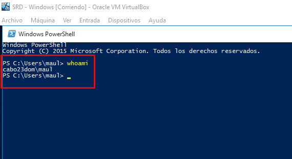

# **UT1-A1 Instalaciones y configuraciones previas**

#### **1. Para esta práctica tendremos que hacer la instalación de cuatro máquinas virtuales:**

- MV de Windows 10.
- MV de Windows 2016 Server.
- MV de Ubuntu.
- MV de Ubuntu Server.

#### **2. Después de la instalación de las MV's, haremos su respectiva configuración de red de cada una de las máquinas.**

###### **- Windows**

###### **- Windows Server**

###### **- Ubuntu**

###### **- Ubuntu Server**

#### **3. Una vez tengamos instaladas y configuradas las MV's, realizaremos un ping entre las dos máquinas de Ubuntu**

#### **Haremos lo mismo en las MV's de Windows**

###### **- Windows Server**

###### **- Windows**

- Si nos llega a dar problemas y no nos hace ping deberiamos de habilitar la siguiente regla del firewall en las dos MV.

#### **4. El siguiente paso será instalar el Active Directory en la MV de Windows Server para crear un dominio, unidades organizativas, grupos y usuarios. Además añadiremos la MV de Windows al dominio y entraremos con los usuarios creados.**

##### **4.1 Instalaremos de Active Directory**

##### **4.2 Crearemos la unidad organizativa, los grupos y los usuarios.**

##### **4.3 Uniremos el equipo al Dominio**

##### **4.4 Iniciaremos sesión con los diferentes usuarios creados de los distintos grupos.**

- **Jedis**

- **Siths**

