# **Instalación y Configuración DHCP Windows**

### **1. Instalación del servicio DHCP en Windows 2016 Server**

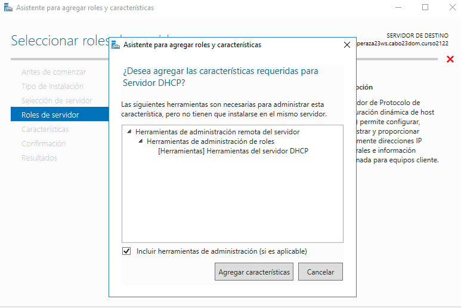

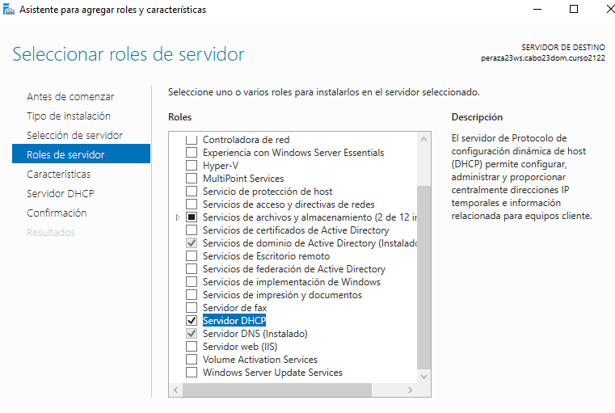

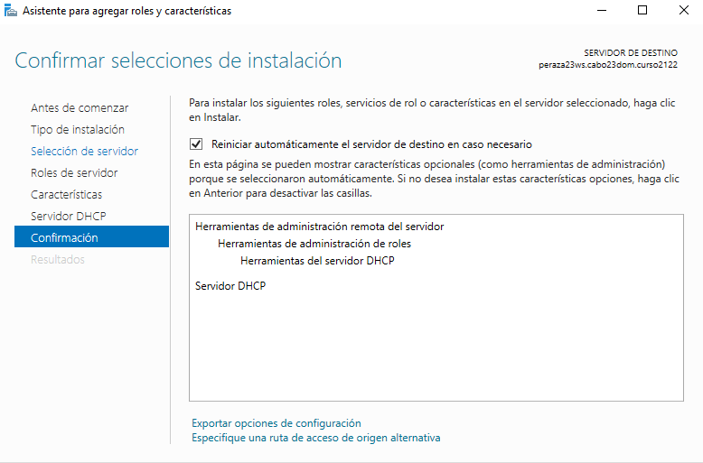

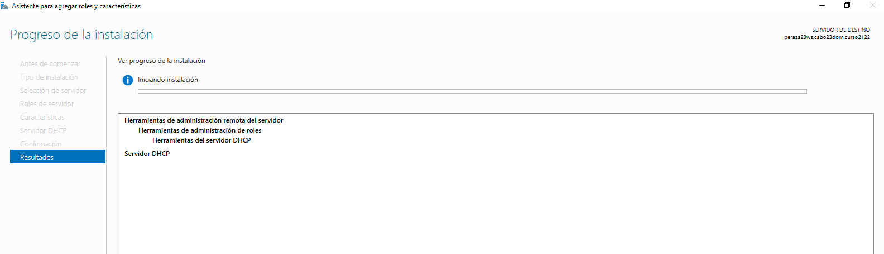

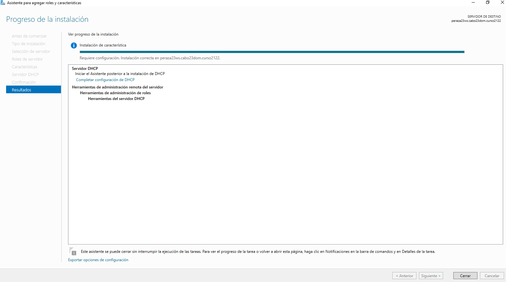

### **2. Configuración del servicio DHCP**

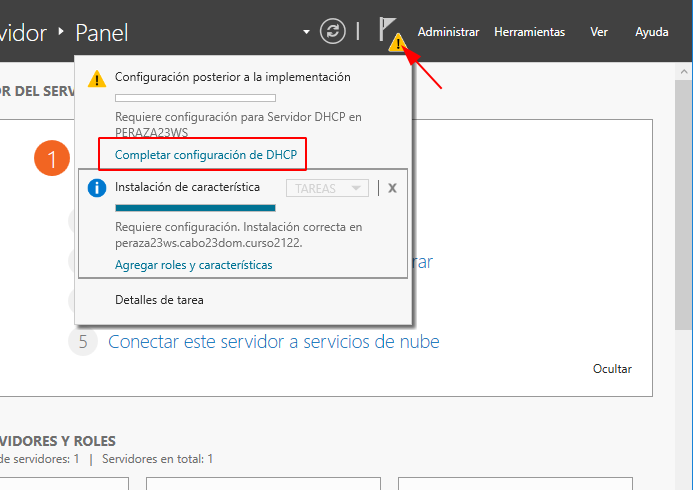

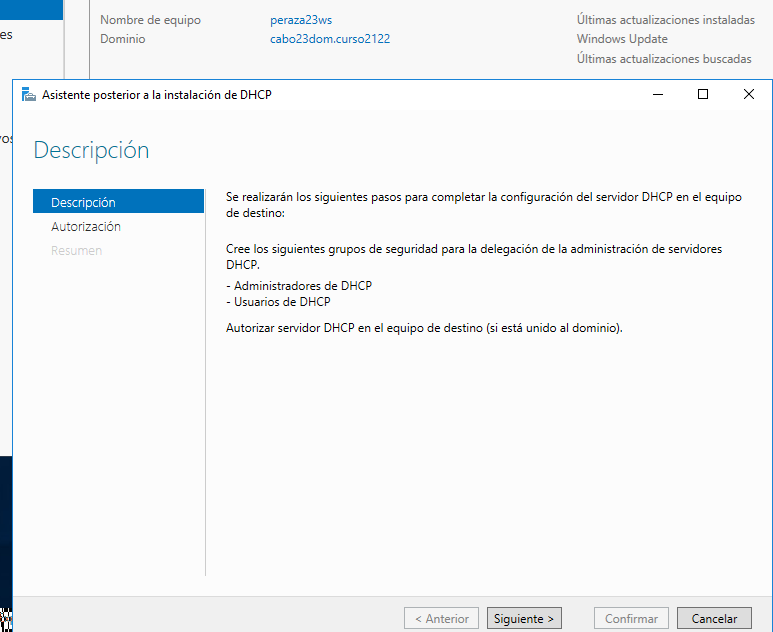

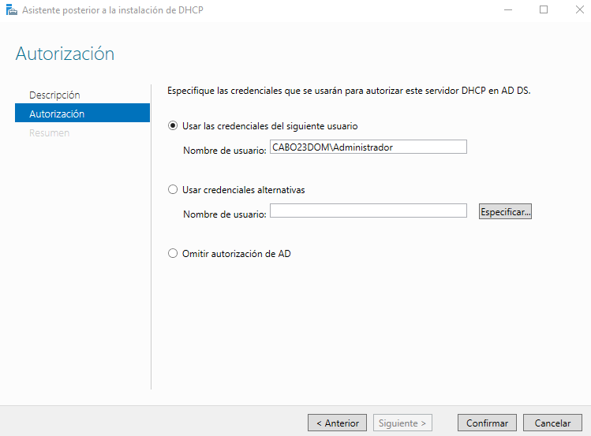

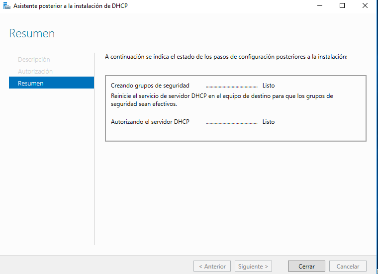

##### **2.1 Creación de un ámbito nuevo asociado al dominio con el intervalo de direcciones IP que consideres conveniente.**

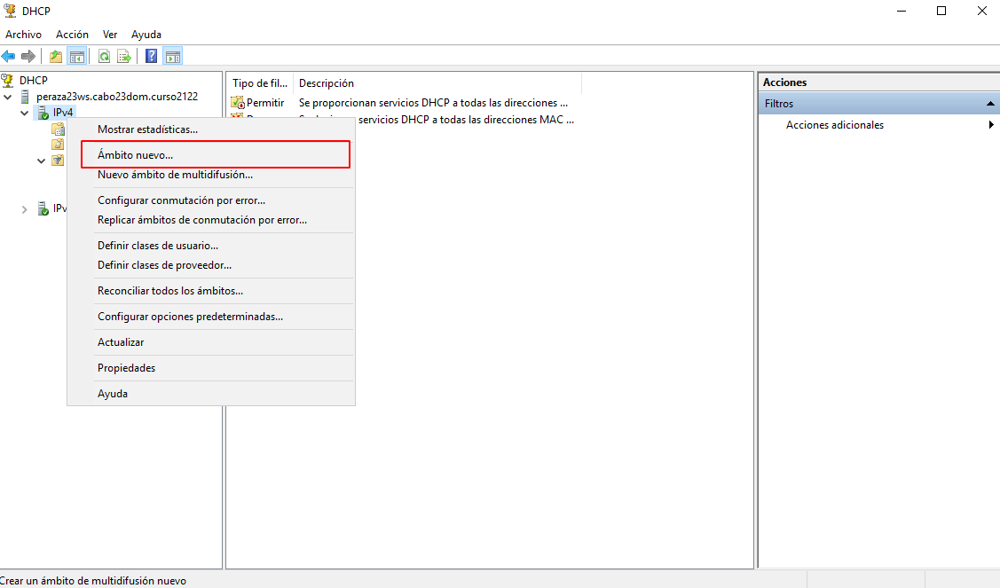

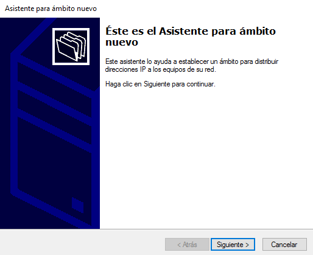

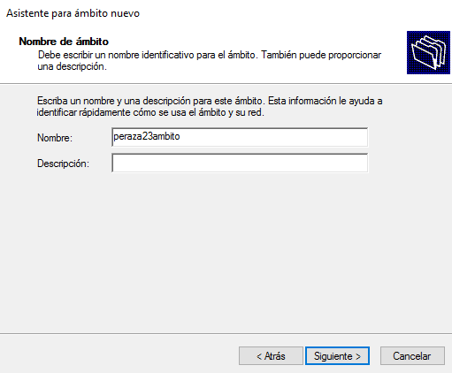

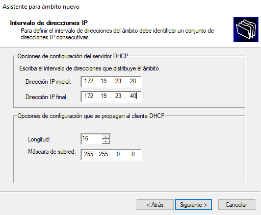

##### **2.2 Agregar exclusiones de direcciones.**

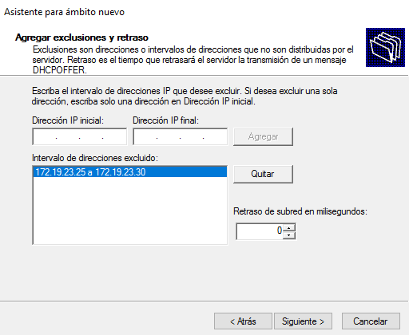

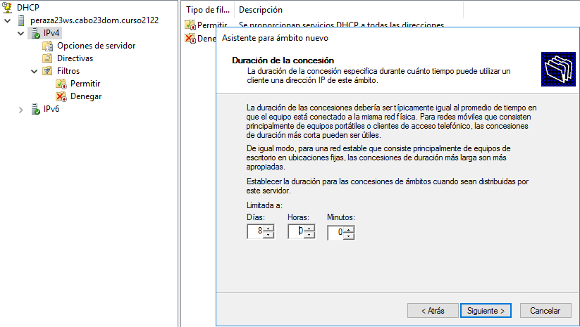

##### **2.3 Configurar puerta de enlace y servidores DNS a suministrar a los clientes.**

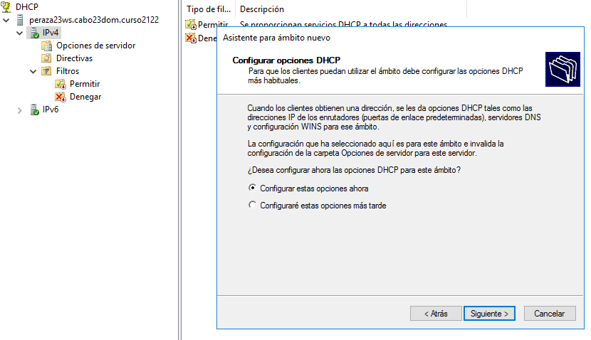

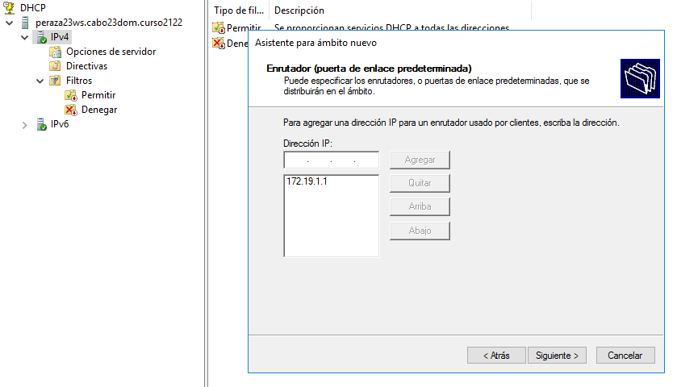

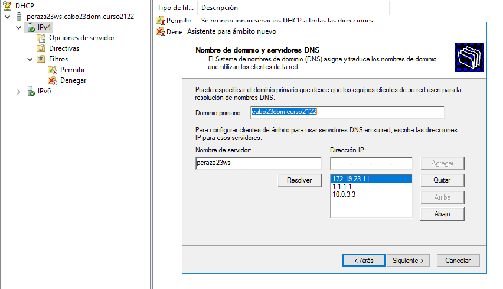

##### **2.4 Configurar resto de opciones necesarias.**

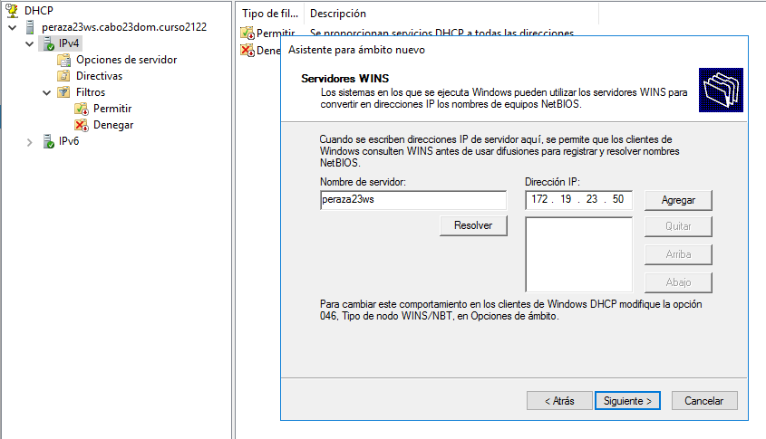

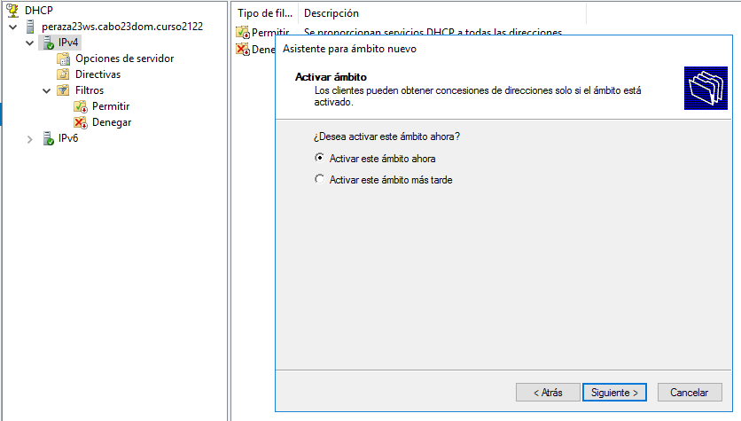

##### **2.5 Establecer una reserva de dirección asociada a un equipo específico (MAC).**

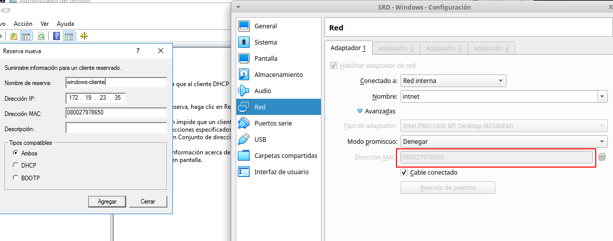

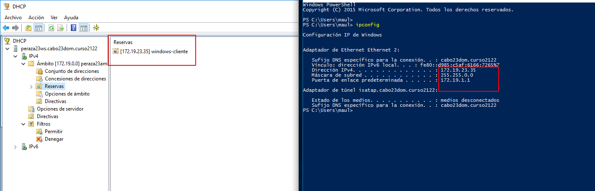

##### **2.6 Configurar algunas opciones de ámbito además de las habituales.**

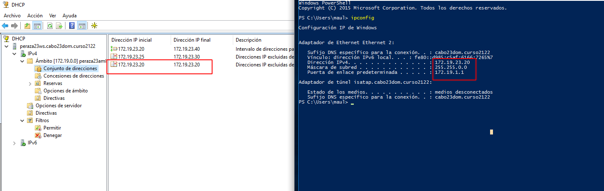

**- Reiniciamos la MV para que se aplique la exclusión.**

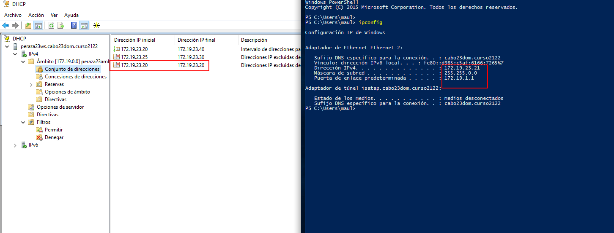

### **3. Comprobar funcionamiento DHCP configurando adecuadamente la máquina cliente y anotando parámetros recibidos.**

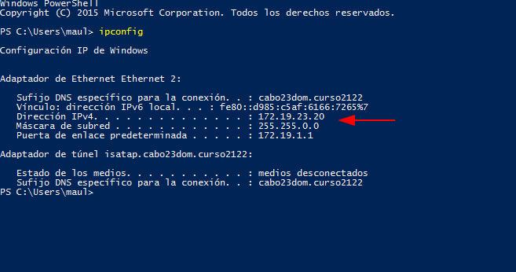

### **4. Tener en cuenta que el servidor no debe estar abierto a la red (configurar adaptador en red interna) para no provocar conflictos de direcciones.**

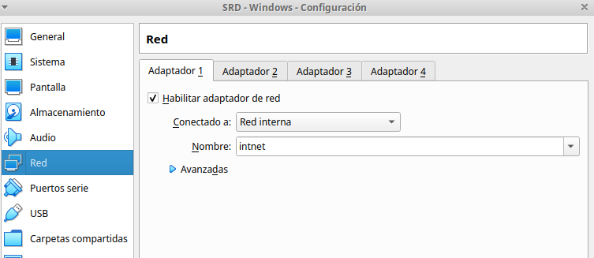

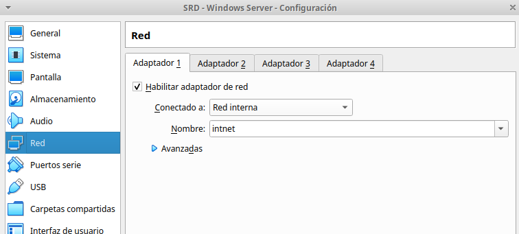
