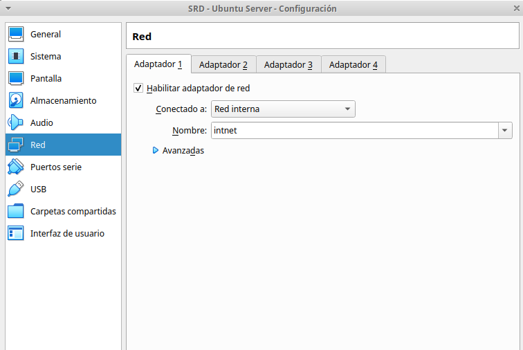
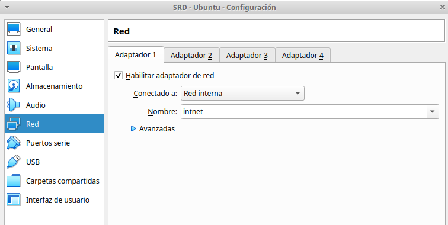

# **Instalación y Configuración DHCP Linux**

### **1. Instalación del servicio DHCP en Ubuntu Linux**

### **2. Configuración del servicio DHCP**

### **3. Comprobar funcionamiento DHCP configurando adecuadamente la máquina cliente y anotando parámetros recibidos.**

### **4. Tener en cuenta que el servidor no debe estar abierto a la red (configurar adaptador en red interna) para no provocar conflictos de direcciones.**

