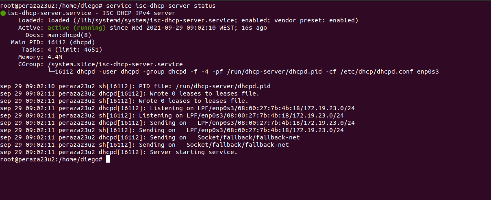
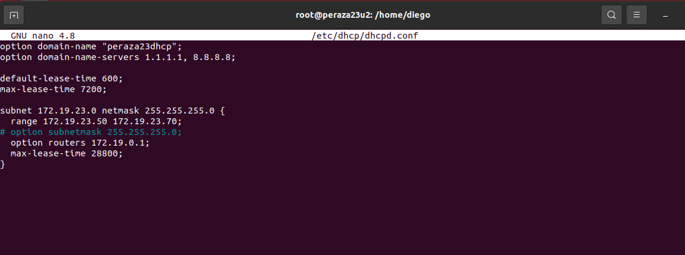
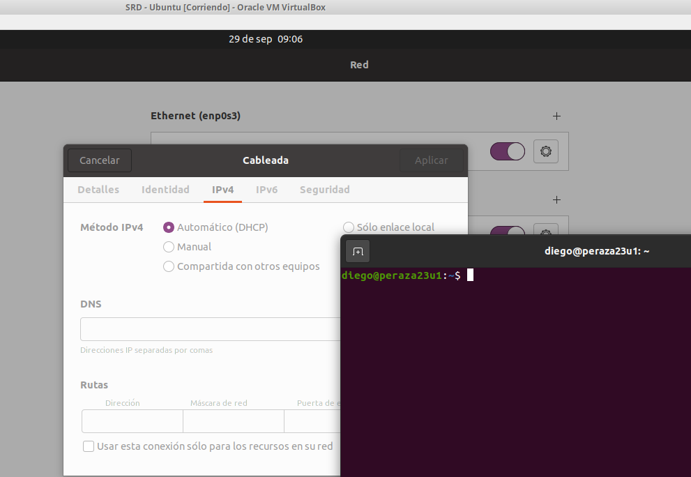
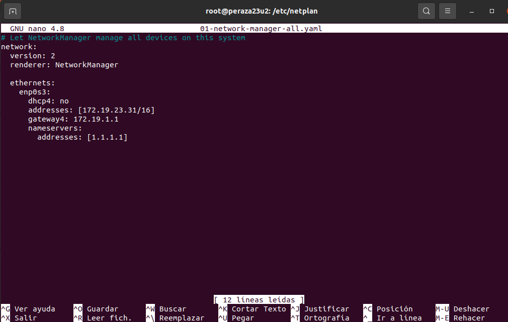
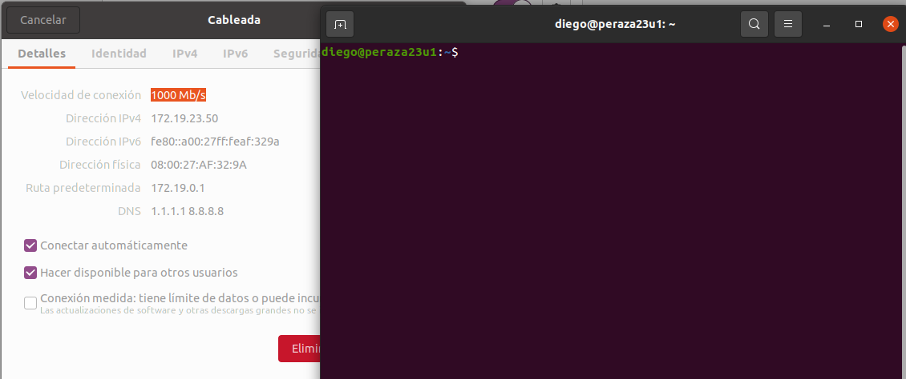
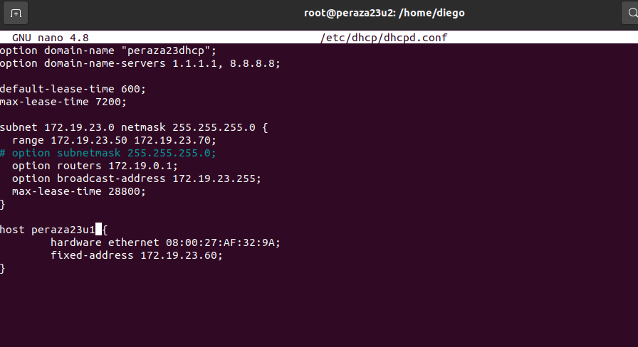
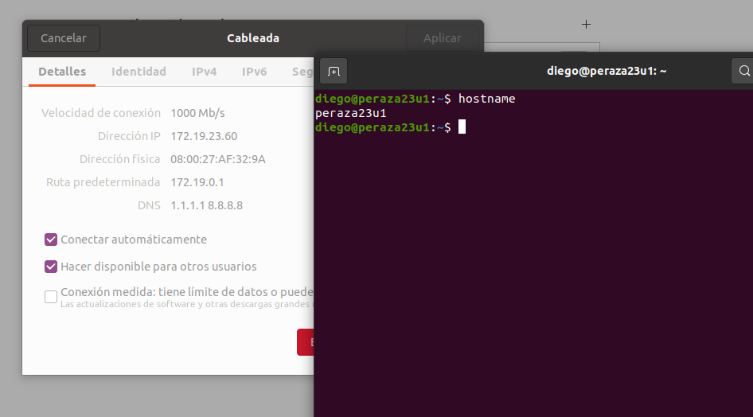
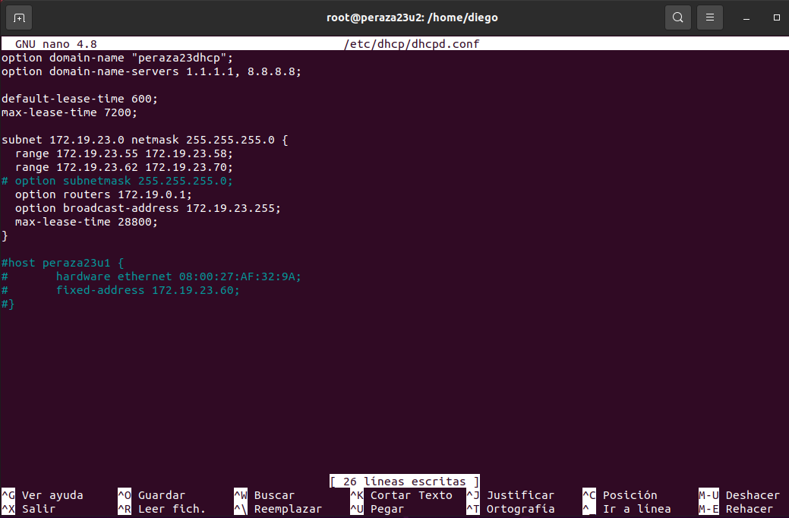
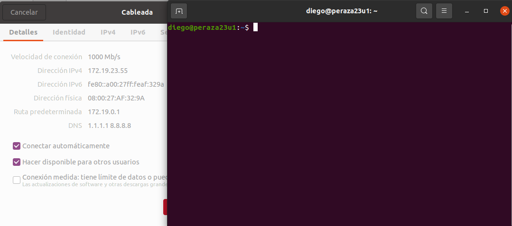

# **Instalación y Configuración DHCP Linux**

### **1. Instalación del servicio DHCP en Ubuntu Linux**

### **2. Configuración del servicio DHCP**

- Para modificar el fichero de configuración del servicio DHCP nos pondremos como superusuario e iremos a la siguiente ruta `/etc/dhcp/` y editaremos el siguiente archivo:

### **3. Comprobar funcionamiento DHCP configurando adecuadamente la máquina cliente y anotando parámetros recibidos.**

#### **3.1 Aplicar un rango de ip's a la red**

- Recordamos que el rango de ip's es ``172.19.23.50-172.19.23.70``

- Comprobamos que se ha aplicado el rango:

#### **3.2 Hacer reserva para un host**

- Comprobamos la Reserva

#### **3.3 Exclusión**

- Comprobamos la Exclusión

### **4. Tener en cuenta que el servidor no debe estar abierto a la red (configurar adaptador en red interna) para no provocar conflictos de direcciones.**

