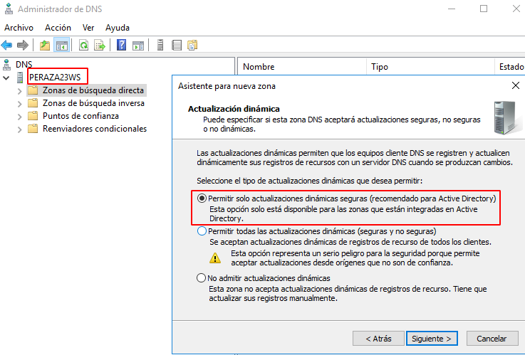

# **Instalación y Configuración DNS Windows Server.**

## **1. Realizamos la configuración de un servidor DNS.**

#### **1.1 Crearemos una zona de búsqueda directa nueva para otro dominio.**

#### **1.2 Crearemos una zona de búsqueda inversa nueva para el nuevo dominio.**

## **2. Configuraremos el servidor para ser servidor DNS Caché.**

- **Configuración de red**:

- **Servidor**:

- **Cliente**:

- Comprobaremos el funcionamiento como caché DNS de ambas máquinas al acceder a sitios de Internet.

- **Servidor**:

- **Cliente**:

#### **2.1 Configurar reenviadores de DNS con puerta de enlace actual y DNS público.**

#### **3. Configuraremos el servidor como DNS Maestro, además de Caché.**
#### **3.1 Añadiremos los siguientes registros en la zona de búsqueda directa.**

- Un alias para tu servidor denominado server.
- Una impresora con IP fija denominada printer.
- Un servidor de correo (ficticio) denominado correo, asociado a una dirección en tu servidor.

- Crear una subzona denominada servicios (dominio nuevo) y agregar a ésta un servidor ftp (asociado a la misma IP del servidor), una impresora nueva (con una IP fija) y el equipo del administrador del sistema (también con IP fija).

## **4. Comprobamos que se resuelven los nombres desde la consola del servidor.**

- **ZBD**

- **Servicios**

- **ZBI**

## **5. Validamos un cliente al dominio y comprobamos que el nombre de su equipo aparece en la zona de búsqueda del servidor como un nuevo registro A.**

## **6. Comprobamos desde la consola cliente que se resuelven correctamente los nombres dados de alta en el servidor.**

- **ZBD**

- **Servicios**

- **ZBI**

## **7. Realizamos desde el cliente  algunas operaciones con nslookup tanto dentro como fuera de nuestra intranet**

