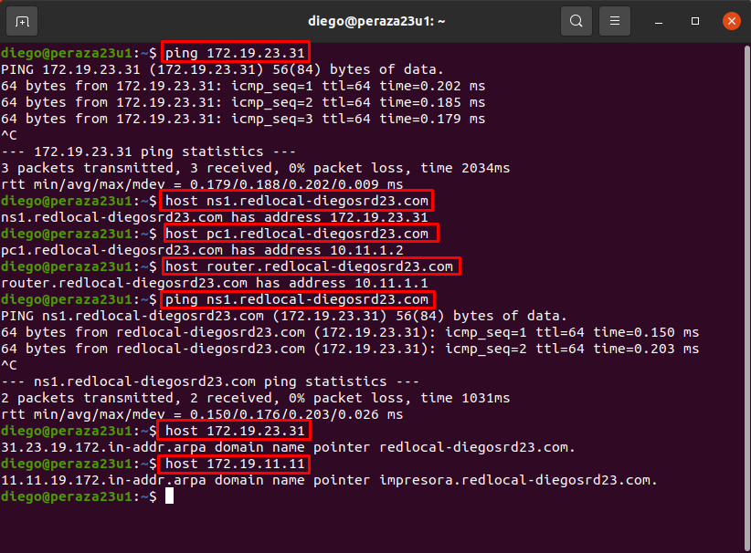

# **Práctica Servidor DNS Linux bind9**

### **0. Configuración de red de la MV Servidor DNS**

- Reiniciamos la MV y comrpobamos que se han guardado los cambios.

- Ahora en la MV Cliente, pondremos como servidor DNS a nuestro servidor para que haya comunicación entre ellos.

### **1. Indicaremos a Linux que el servidor DNS es él mismo ``(/etc/resolv.conf)``**

- `sudo nano /etc/resol.conf`

### **2. Instalamos y configuraremos bind9**

- Una vez que hayamos instalado todos los paquetes anteriores, nos movemos al directorio del programa `/etc/bind`, que es donde empezaremos a configurar los archivos necesarios.

### **2.1 Configuraremos los fowarders de bind usando servidores DNS públicos (servidor DNS caché)**

- Reinicamos el servicio.

- Ahora comprobaremos de que al ejecutar el comando ``nslookup``, veremos que nuestro servidor DNS ha resuelto un dominio correctamente.

- **Servidor**

- **Cliente**

### **3. Configuramos como DNS maestro instalando un dominio ficticio y añadiendo configuración para búsquedas ``(/etc/bind/named.conf.local)``**

### **4. Creamos y configuramos un archivo de ZBD y otro de ZBI**

- **Zona de búsqueda directa**

- Guardamos la configuración y comrpobamos que la sintaxis está correcta.

- **Zona de búsqueda inversa**

- Guardamos la configuración y comrpobamos que la sintaxis está correcta.

### **5. Comprobaremos de que se resuelven todos los nombres desde la consola del servidor**

- ZBD

- Algunos nombres no dan ping, ya que son ficticios.

- ZBI

### **6. Comprobamos desde el Cliente que se resuelven correctamente los nombres dados de alta en el servidor**

