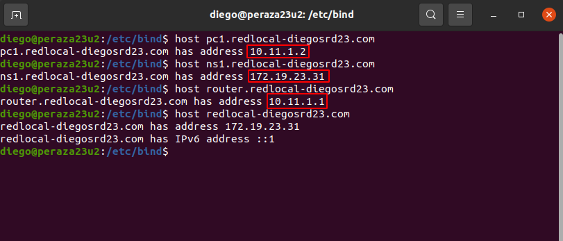
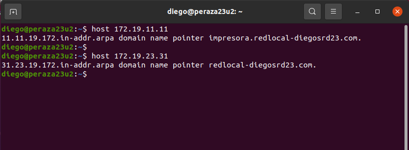

# **Práctica Servidor DNS Linux bind9**

|  MV    | Equipo     | IP|
| :------------- | :------------- | :------------- |
| Servidor DNS Master      | peraza23u2       | 172.19.23.31|
| Servidor DNS Slave      | peraza23u3       | 172.19.23.32|
|Cliente      | peraza23u1       | 172.19.23.50|

### **0. Configuración de red de la MV Servidor DNS**

- Editaremos el siguiente fichero para que nuestro Servidor DNS, este configurado con IP estática, además añadiremos que él es el propio DNS.

- Reiniciamos la MV y comrpobamos que se han guardado los cambios.

- Ahora en la MV Cliente, pondremos como servidor DNS a nuestro servidor para que haya comunicación entre ellos.

### **1. Indicaremos a Linux que el servidor DNS es él mismo ``(/etc/resolv.conf)``**

- `sudo nano /etc/resolv.conf`

### **2. Instalamos y configuraremos bind9**

- Una vez que hayamos instalado todos los paquetes anteriores, nos movemos al directorio del programa `/etc/bind`, que es donde empezaremos a configurar los archivos necesarios.

### **2.1 Configuraremos los fowarders de bind usando servidores DNS públicos (servidor DNS caché)**

- Reinicamos el servicio.

- Ahora comprobaremos de que al ejecutar el comando ``nslookup``, veremos que nuestro servidor DNS ha resuelto un dominio correctamente.

- **Servidor**

- **Cliente**

### **3. Configuramos como DNS maestro instalando un dominio ficticio y añadiendo configuración para búsquedas ``(/etc/bind/named.conf.local)``**

### **4. Creamos y configuramos un archivo de ZBD y otro de ZBI**

- **Zona de búsqueda directa**

- Guardamos la configuración y comprobamos que la sintaxis está correcta.

- **Zona de búsqueda inversa**

- Guardamos la configuración y comprobamos que la sintaxis está correcta.

### **5. Comprobaremos de que se resuelven todos los nombres desde la consola del servidor**

- **ZBD**

- Algunos nombres no dan ping, ya que son ficticios.

- **ZBI**

### **6. Comprobamos desde el Cliente que se resuelven correctamente los nombres dados de alta en el servidor**

### **7. Investigación: Cloanremos la MV del servidor bind9 y configura el nuevo linux para que bind9 se comporte como un servidor esclavo (slave) del principal (master).Comprueba el funcionamiento entre maestro, esclavo y cliente.**

- **Slave**

- **Master**

- **Cliente**

- **Comprobaciones:**

- Para hacer la comprobación desactivaremos el servicio bind9 en el servidor Master, para que el servidor Slave nos haga de soporte.

- Después vamos al cliente y comprobamos los nombres y también pondremos nslookup para comprobar de que el servidor DNS Slave está actuando.

***Hasta aquí queda por finalizada la actividad.***
