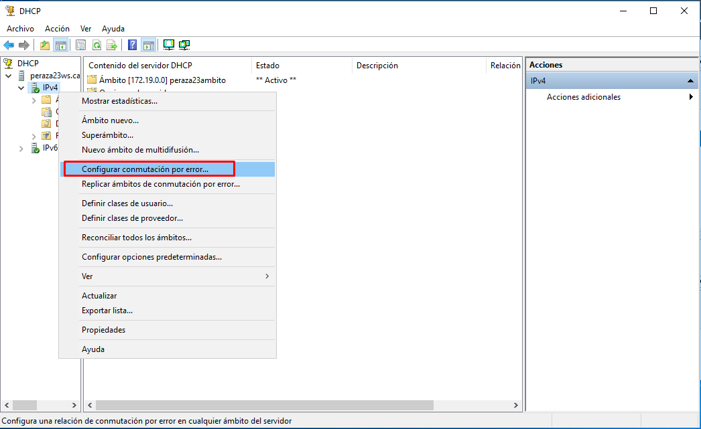
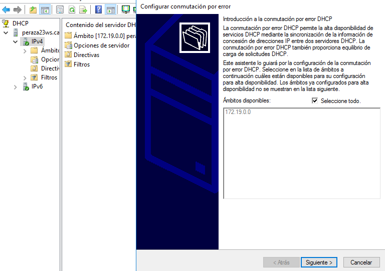
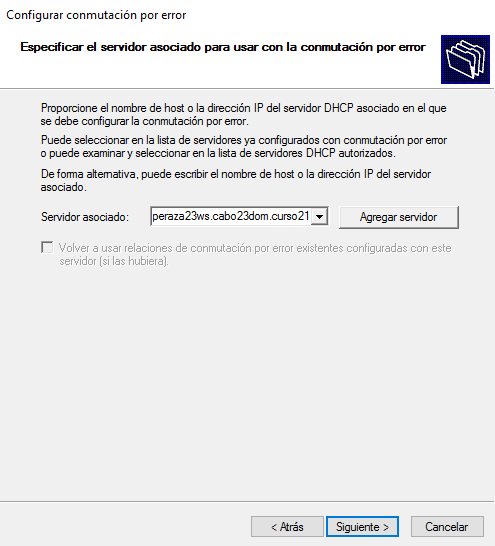
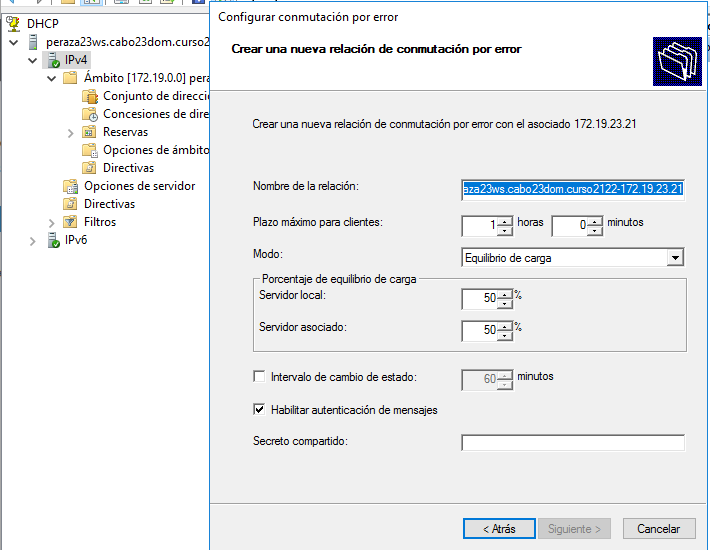
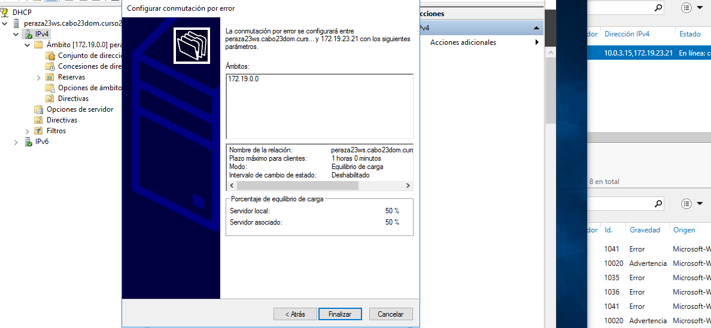
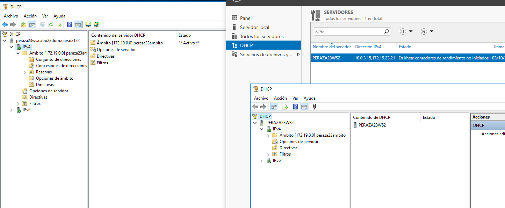
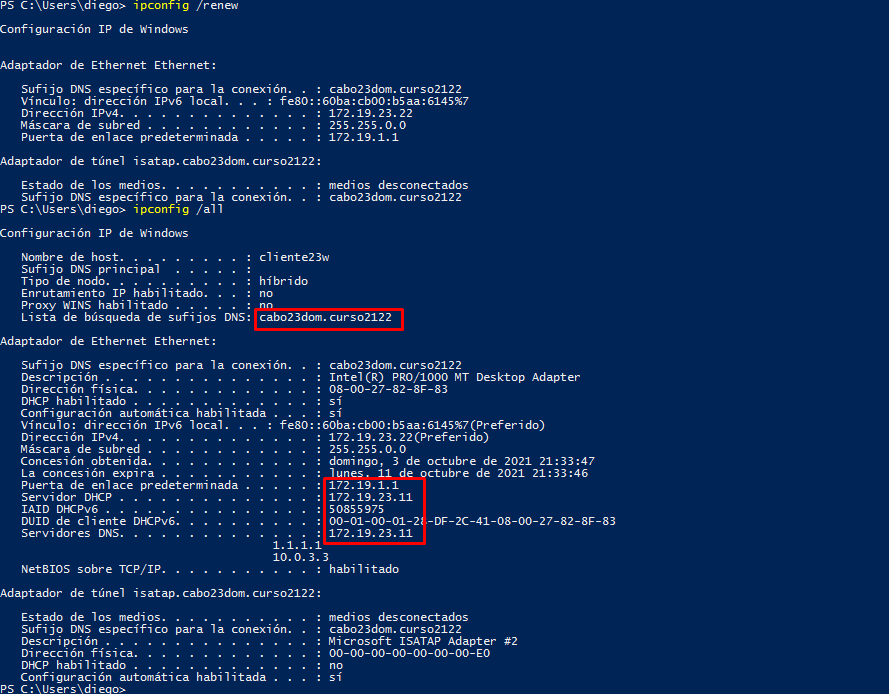
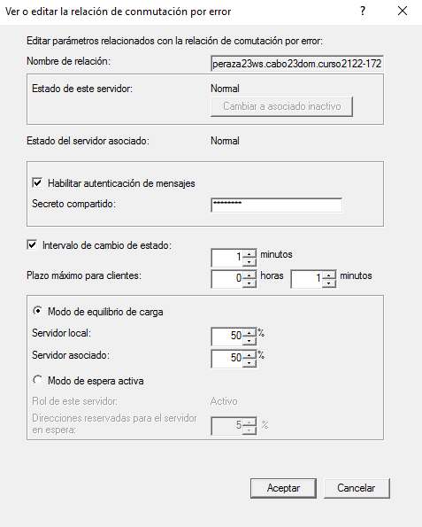
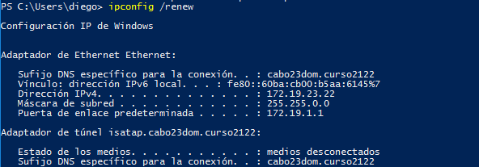
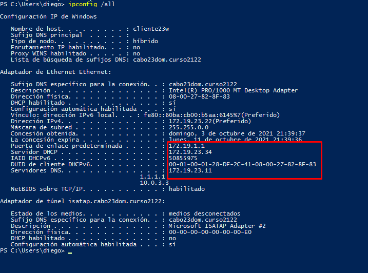

# **DHCP Failover en Windows 2016 Server**

### **0. Preparativos**
- Recordad de tener la MV en **Red interna**

| MV     | IP     |
| :------------- | :------------- |
| Windows Server - peraza23ws | 172.19.23.11 |
| Windows Server - peraza23ws2 | 172.19.23.34 |
| Windows Cliente| DHCP   |

### **1. Configurar conmutación por error**

- Iremos al primer servidor de DHCP para configurar el Failover, para ello iremos a ``Herramientas > DHCP > IPv4`` y le damos click derecho en el mismo.

- Seleccionaremos todo y siguiente.

- Ahora pondremos la ip del otro servidor DHCP, en servidor asociado y le daremos a siguiente.

- Pondremos una contraseña y le daremos a siguiente:

- Y por último le daremos a finalizar.

### **1.1 Comprobaciones**

- Comprobamos que en el otro servidor se ha duplicado el mismo contenido.

- Ahora en la máquina cliente veremos que se ha conectado al primer servidor DHCP.

- Modificaremos el plazo de cliente máximo y el intervalo de cambio de estado a 1 min.

### **2. Comprobar que funciona el Failover**

- En este punto apagaremos el servidor DHCP ``peraza23ws`` , lo cual el servidor DHCP ``peraza23ws2`` actuará de respaldo.

- Comprobaremos mediante comandos en el cliente que se ha cambiado la ip.

- Primero pondremos el comando `ipconfig /relase` para liberar la ip , lo segundo `ipconfig /renew` para renovar la ip, y por último pondremos `ipconfig /all` para ver que se ha conectado al otro servidor.

