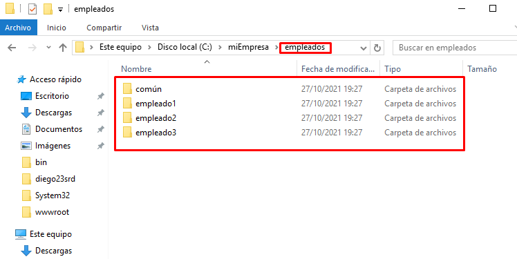

# **Informe IIS - Servidor Web avanzado**

## **Carpetas privadas**

### **1. Crearemos una carpeta ``empleados``  (dentro de miEmpresa) y, dentro de esta, tres o cuatro subcarpetas personales con nombres de empleados y una, denominada común, a la que tendrán acceso todos los empleados, pero no otros usuarios sin identificar.**

### **2. Crearemos el nuevo sitio web, como subdominio de nuestro dominio principal, asociado a la carpeta genérica empleados**

