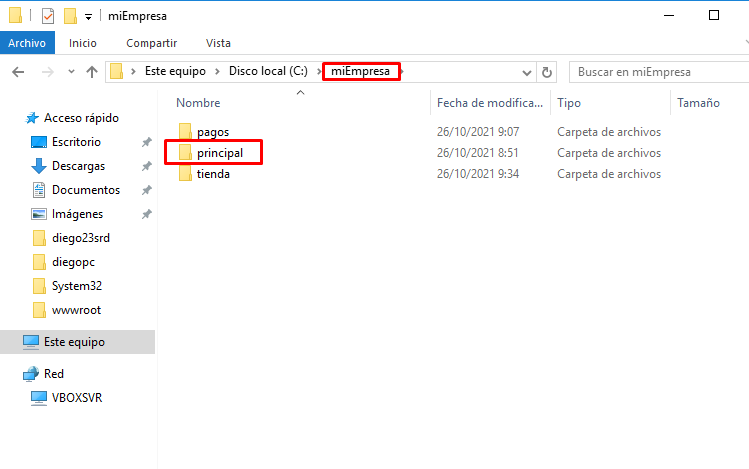
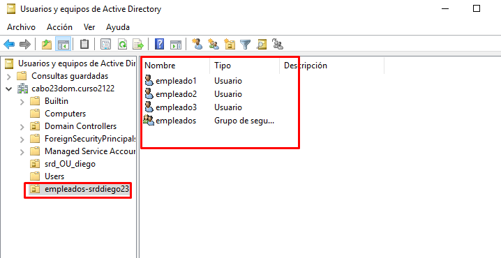

# **Informe IIS - Servidor Web avanzado**

## **Carpetas seguras**

### **1. Creamos una nueva zona de búsqueda directa en los servicios DNS asociado al dominio miEmpresa. Crea también una carpeta miEmpresa en C:\ y una subcarpeta ‘principal’.**

### **2. Creamos un nuevo sitio web denominado miEmpresa en IIS asociado a la subcarpeta anterior y con acceso a través de la dirección www.miEmpresa.com. Actualiza DNS adecuadamente.**

### **3. Creamos el sitio web, asociado a una carpeta (miEmpresa\pagos) y con la configuración adecuada en IIS y en los servicios DNS. Comprueba el acceso (aún vía ‘http’) con un navegador desde el propio servidor y desde un cliente W7**

## **Carpetas privadas**

### **1. Crearemos una carpeta ``empleados``  (dentro de miEmpresa) y, dentro de esta, tres o cuatro subcarpetas personales con nombres de empleados y una, denominada común, a la que tendrán acceso todos los empleados, pero no otros usuarios sin identificar.**

### **2. Crearemos el nuevo sitio web, como subdominio de nuestro dominio principal, asociado a la carpeta genérica empleados**

### **3. Colocamos un fichero index.html diferente en cada una de las carpetas creadas, con el objetivo de poder comprobar el acceso desde un navegador.**

### **4. Para el sitio web creado y para cada una de sus carpetas, deshabilitamos el acceso anónimo y agregamos función de Autenticación Básica a nuestro Servicio de IIS a través de la Administración del Servidor**

### **5. En Active Directory, crearemos un usuario para cada empleado (tantos como carpetas personales) y un grupo Empleados que los incluya a todos.**

### **6. Desactivamos, para la carpeta empleados, los permisos heredables a través de las opciones avanzadas en la ficha de seguridad. Añadimos grupo de Administradores con Control Total y grupo Empleados con Lectura y Ejecución+ Mostrar Carpeta+Leer.**

### **7. Realizamos el mismo procedimiento para cada una de las carpetas personales de los empleados, colocando como usuarios autorizados el Grupo de Administradores (Control Total) y el empleado propietario de cada carpeta (con los permisos que creas convenientes).**

### **8. Realizamos el mismo procedimiento para la carpeta ‘comun’, colocando como usuarios autorizados el Grupo de Administradores (Control Total) y el grupo Empleados (con los permisos que creas convenientes).**

### **9. Comprobamos el acceso, tanto desde el servidor como desde el cliente W7, a las diferentes carpetas con distintos usuarios.**

- **Servidor**

- **Cliente**

