# **Informe IIS - Servidor Web avanzad - Instalación de PHP, MySQL y PHPMyAdmin**

### **0. Preparativos**

| Programas       | Versiones      |
| :------------- | :------------- |
| Item One       | Item Two       |

### **1. Instalación de PHP**

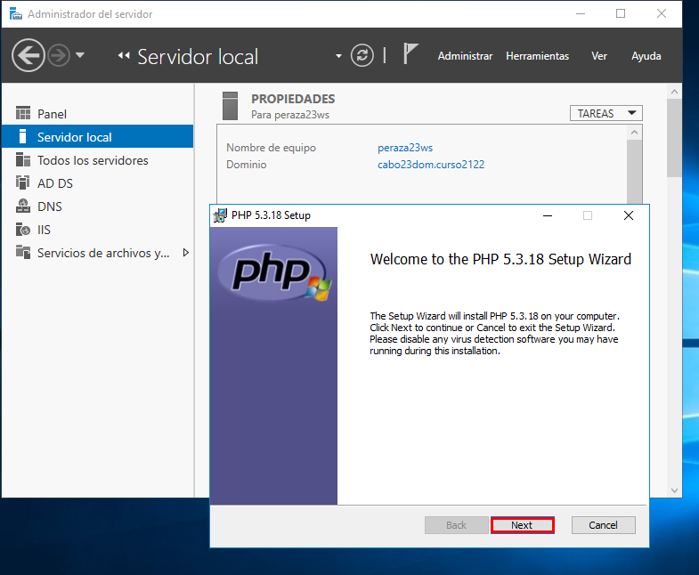

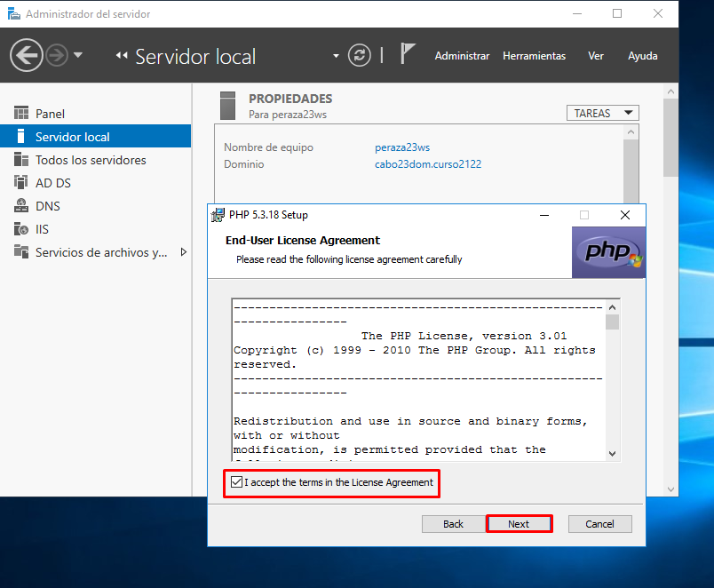

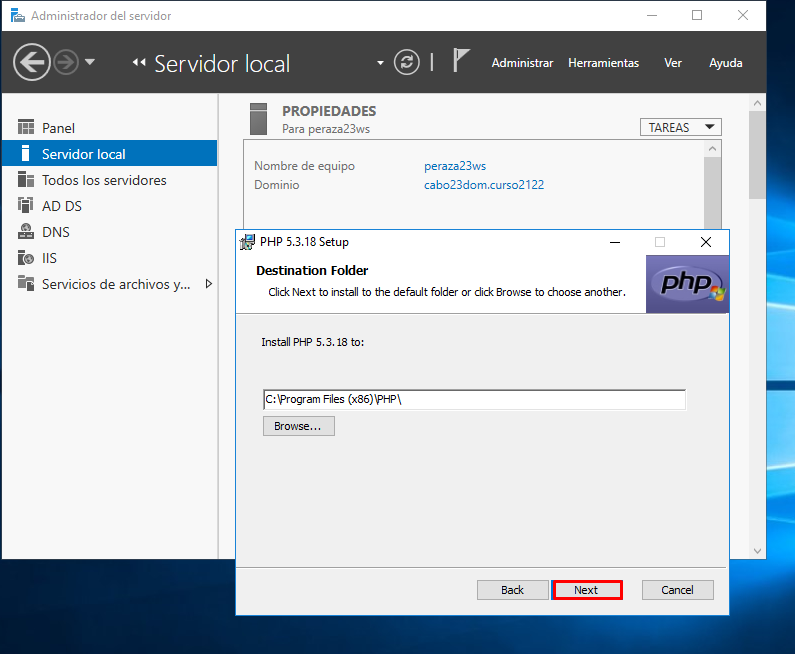

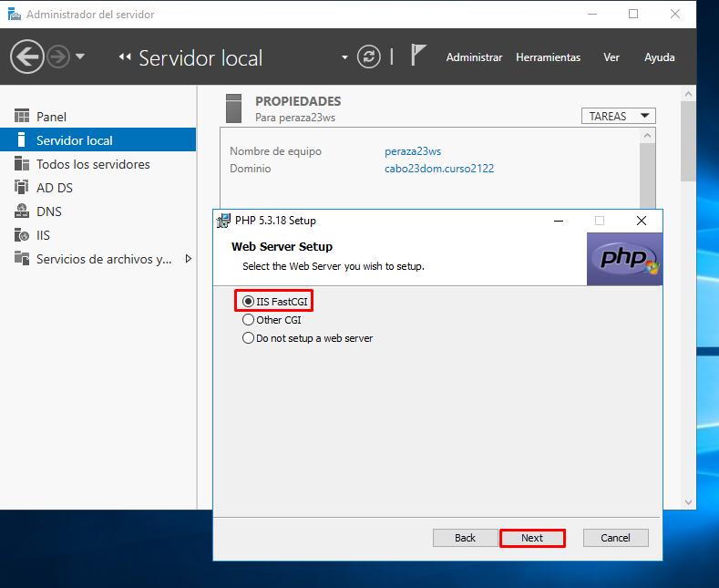

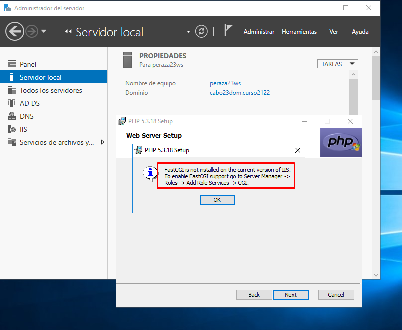

- Para seguir con la instalación debemos agregar el rol de ``CGI`` que esta dentro de nuestro Servidor Web (IIS).

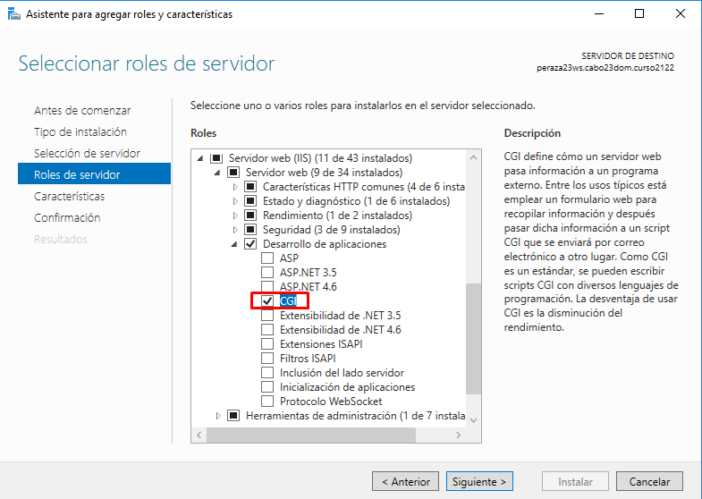

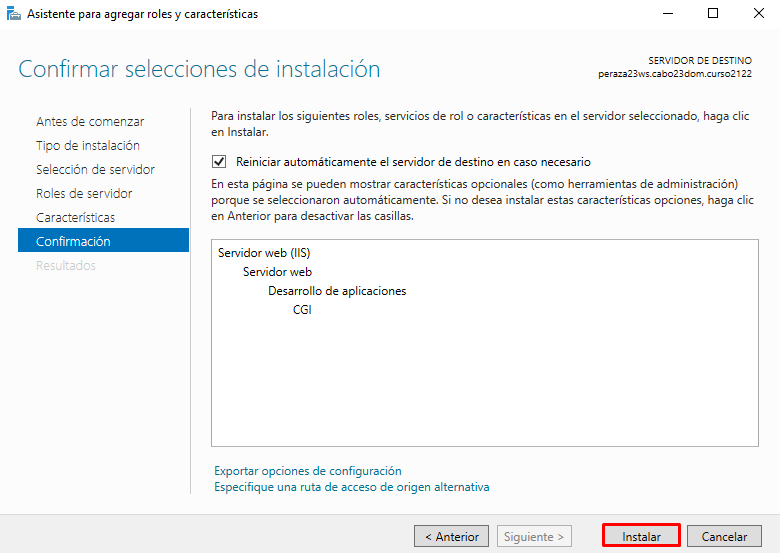

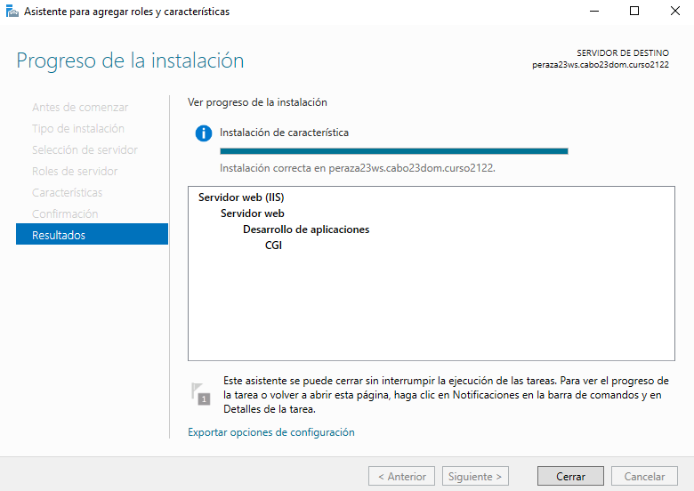

- Volvemos con la instalación de PHP.

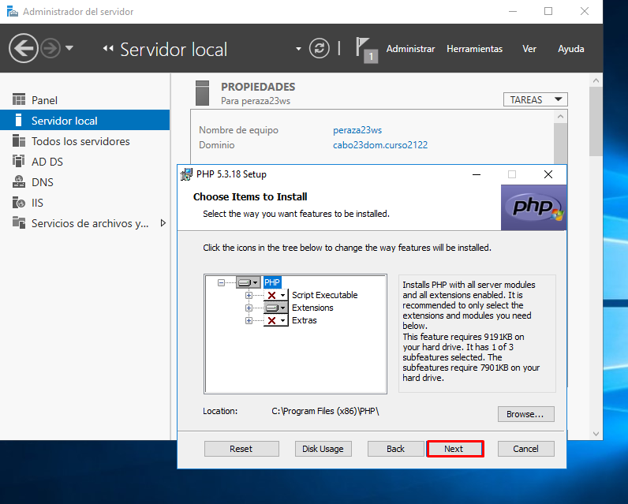

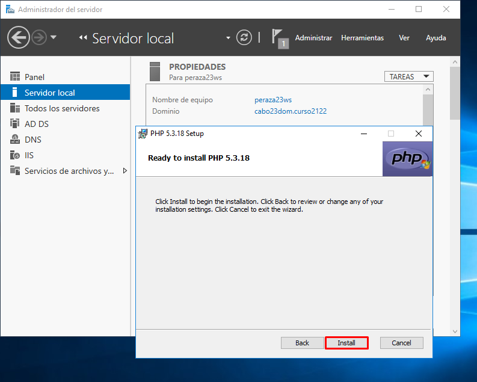

- Una vez tengamos PHP instalado, configuraremos nuestro IIS para que admita el fichero index.php por defecto .

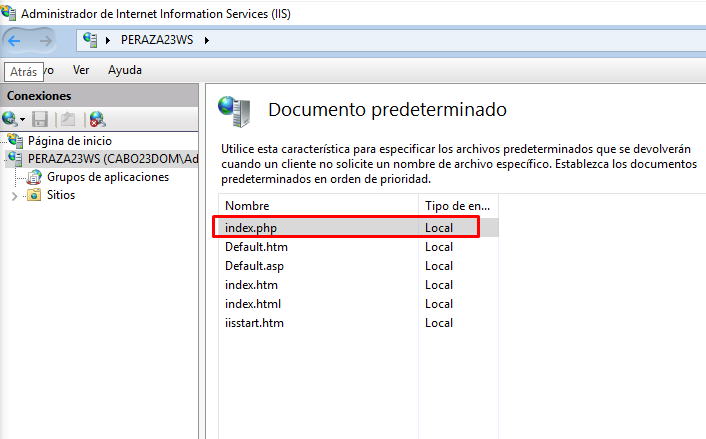

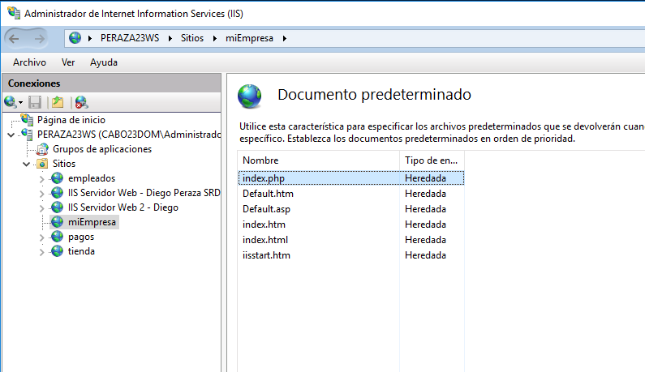

### **2. Comprobamos que la instalación de PHP es correcta.**

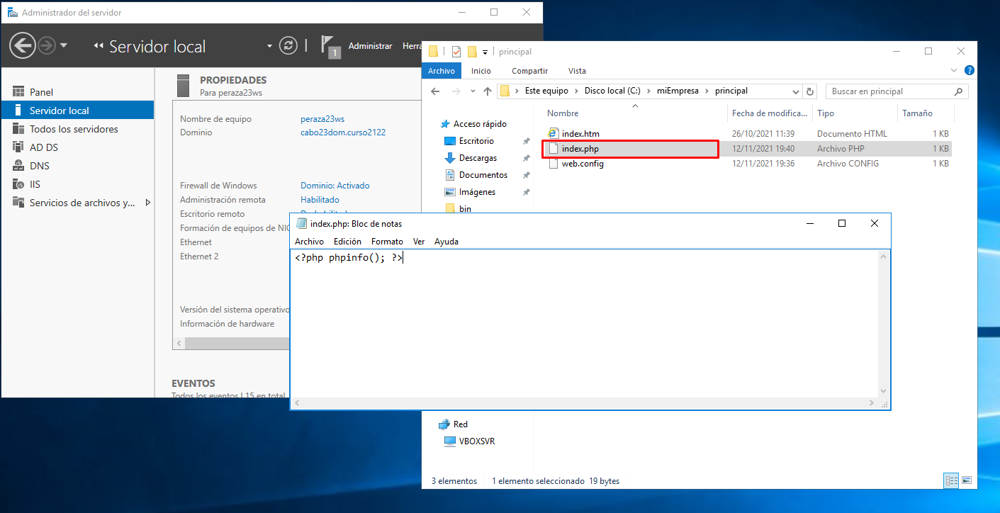

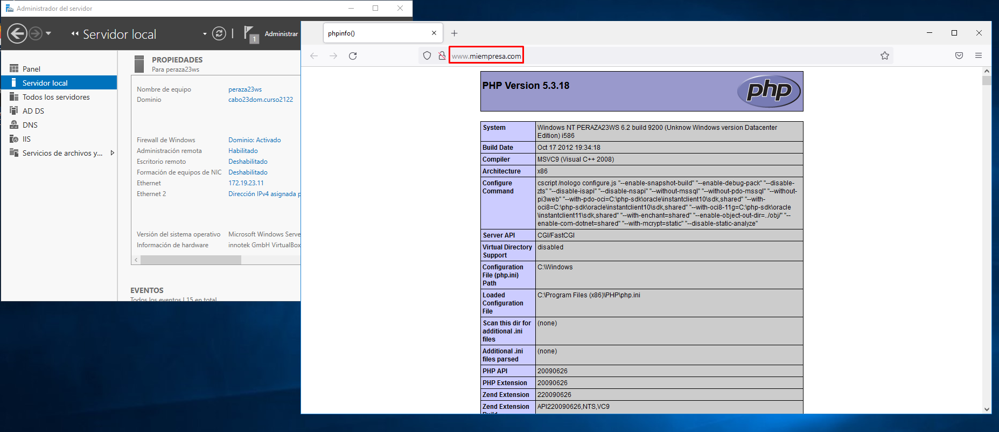

### **3. Instalación de MYSQL**

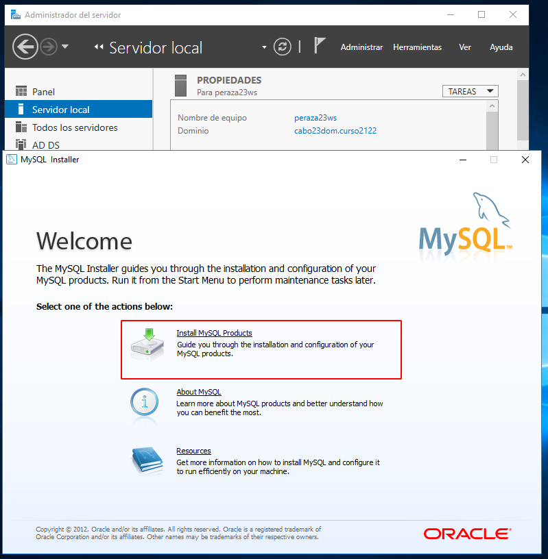
