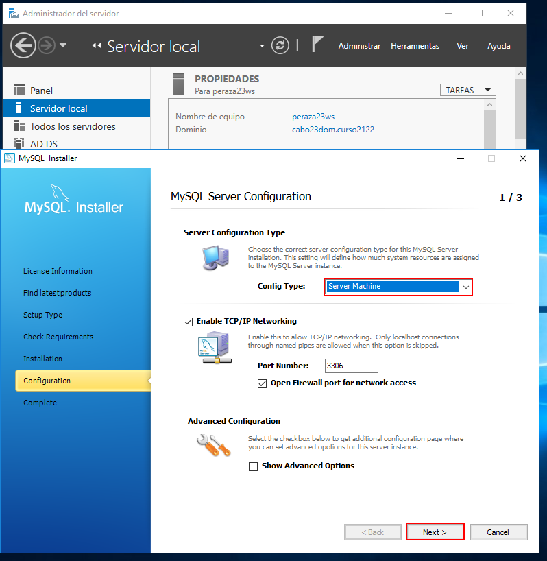
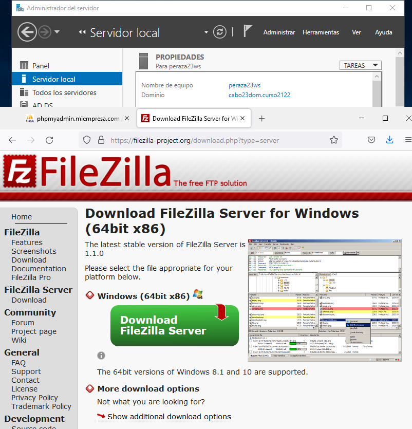

# **Informe IIS - Servidor Web avanzad - Instalación de PHP, MySQL y PHPMyAdmin**

### **0. Preparativos**

| Programas       | Versiones      |
| :------------- | :------------- |
| PHP      | 5.3.18       |
| MySQL    | 5.5.28         |
| PHPMyAdmin  | 4.4.15.10         |

### **1. Instalación de PHP**

- Para seguir con la instalación debemos agregar el rol de ``CGI`` que esta dentro de nuestro Servidor Web (IIS).

- Volvemos con la instalación de PHP.

- Una vez tengamos PHP instalado, configuraremos nuestro IIS para que admita el fichero index.php por defecto .

### **2. Comprobamos que la instalación de PHP es correcta.**

### **3. Instalación de MYSQL**

### **4. Instalación de PHPMyAdmin**

- Descomprimiremos los ficheros de PHPMyAdmin en la carpeta correspondiente. Además crearemos un nuevo sitio web asociado a `phpmyadmin.miEmpresa.com`.

- Comprobación

### **5. Instalación del Servidor FTP FileZilla**

### **6. Crear usuario `ftpuser` en el Servidor FTP y crear nuevo  registro DNS que permita acceder a nuestro sitio FTP a través de la dirección ``ftp.miEmpresa.com``.**

