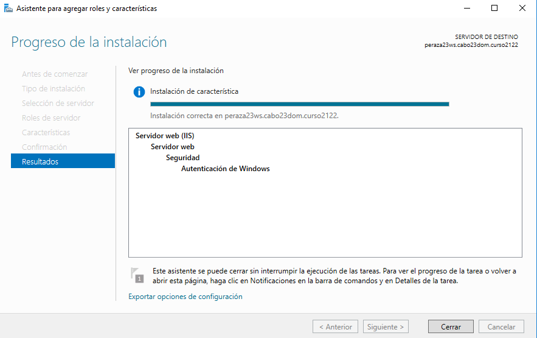
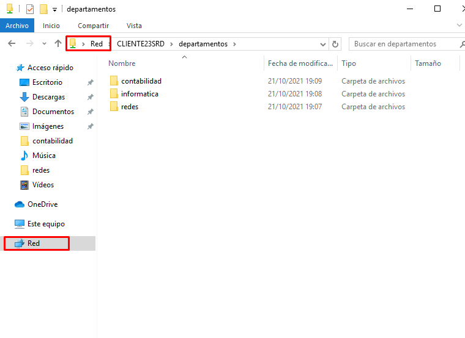
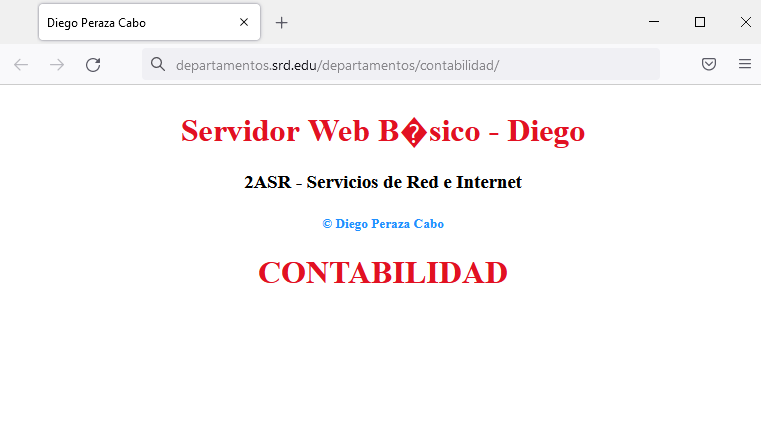

# **Informe IIS - Servidor Web básico**

## **0. Configuración de red del Servidor**

## **1. Instalación del Servidor Web (IIS)**

## **2. Comprobar acceso a nuestro servidor web (localhost)**

## **3. Entrar en un cliente Windows y acceder a la página principal del servidor a través de la IP del servidor.**

## **4. Acceder a la página web cliente, mediante el nombre principal del dominio.**

## **5. Tratar de acceder desde el cliente y servidor al sitio www del dominio principal.**

## **6. Crearemos una página web HTML como página principal y comprobaremos el acceso desde el propio servidor y cliente.**

## **7. Crearemos sitios web independientes, para ello debemos crear un dominio nuevo y un subdominio e incorporaremos una página web.**

## **8. Crearemos un directorio virtual y dentro debe contener 3 subcarpetas con páginas html diferentes.**

