# **Práctica Servidor Web Apache - Linux**

### **Configurar MV Ubuntu o similar en adaptador Puente**

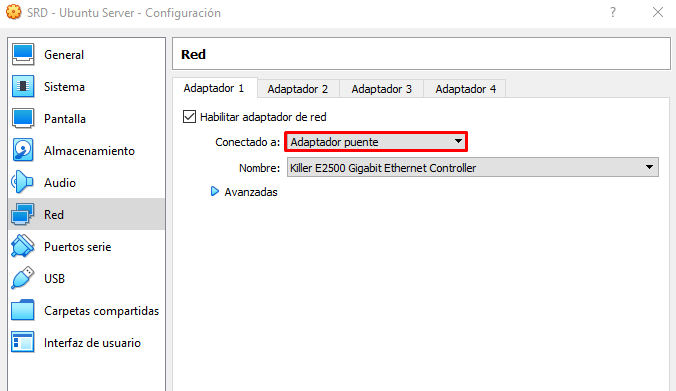

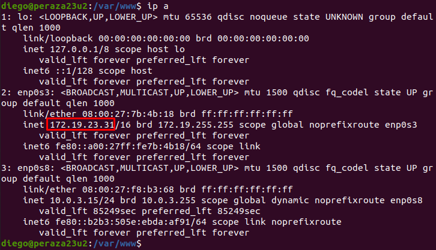

### **Apache**

- Instalar Apache:

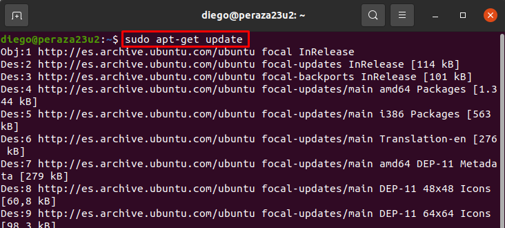

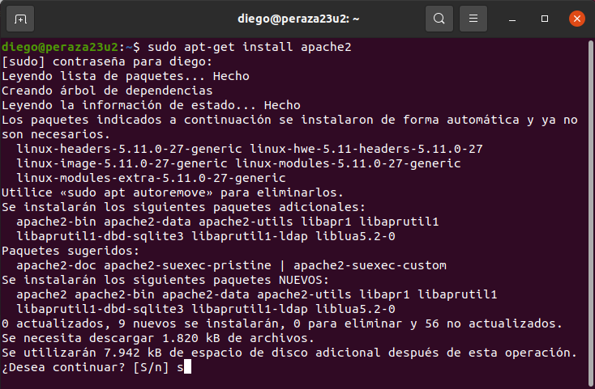

- Comprobar la carpeta raíz sitio web.

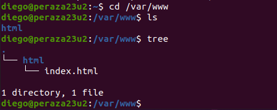

- Comprobar acceso a localhost o 127.0.0.1:

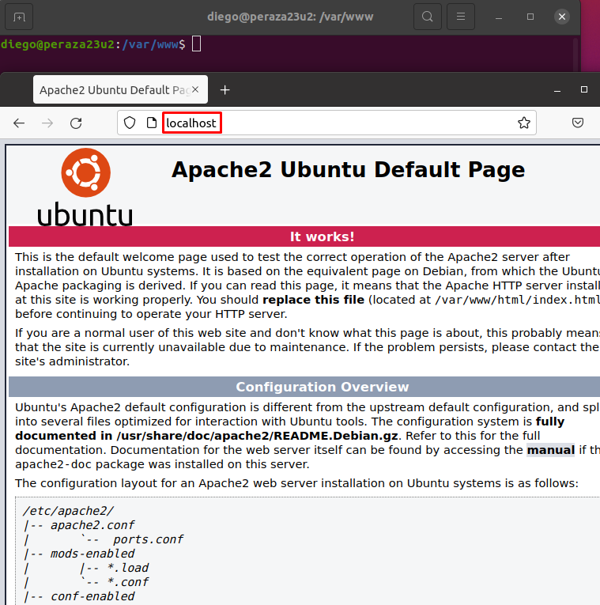

- Editar el fichero `/etc/hosts` y añadir la siguiente línea.

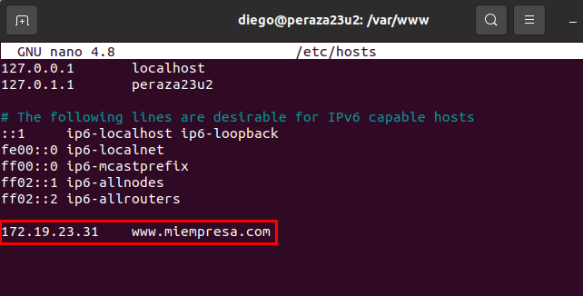

- Reiniciamos Apache.

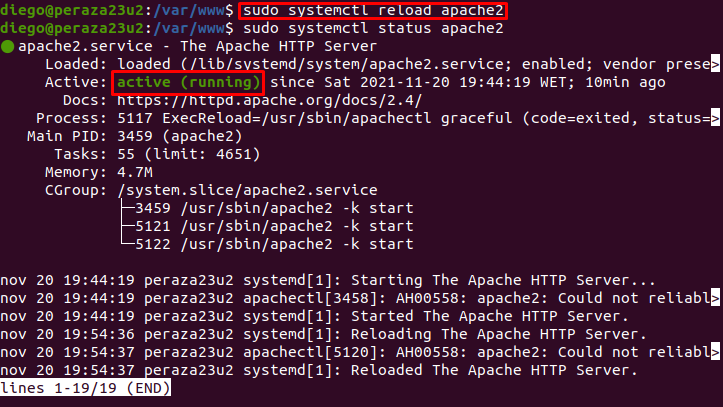

- Comprobar acceso.

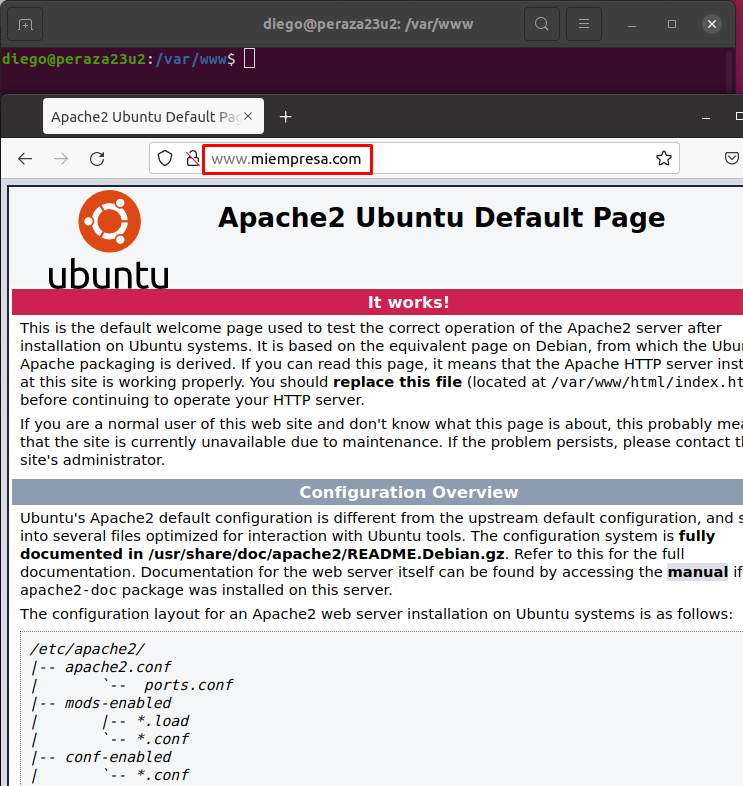

- Error + Access logs:

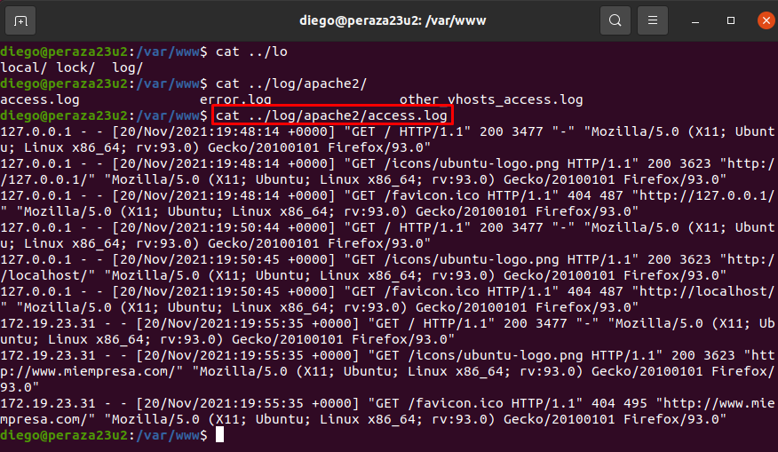

### **PHP**

- Instalar PHP 7.4 y el paquete `libapache2-mod-php7.4`:

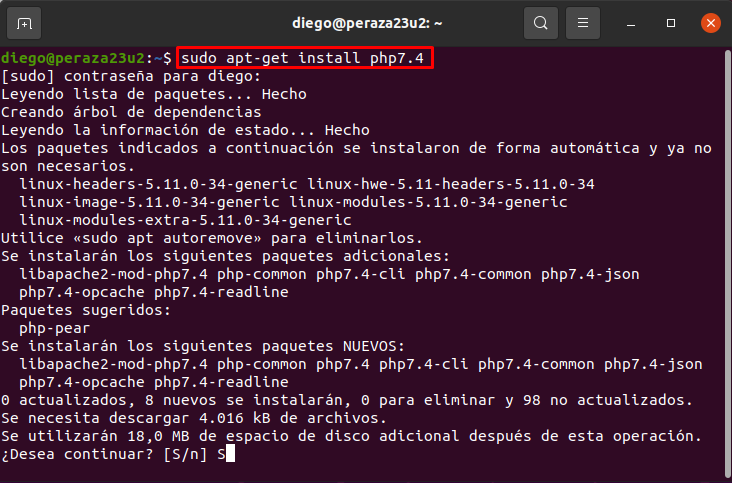

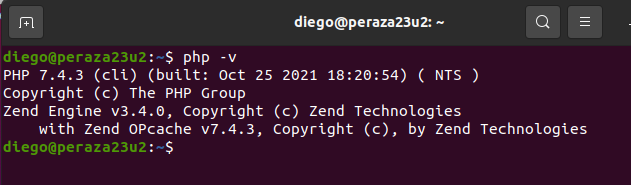

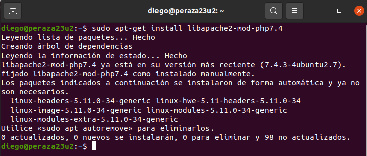

- Comprobar acceso a index.php:

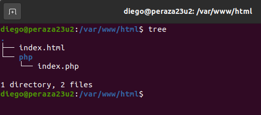

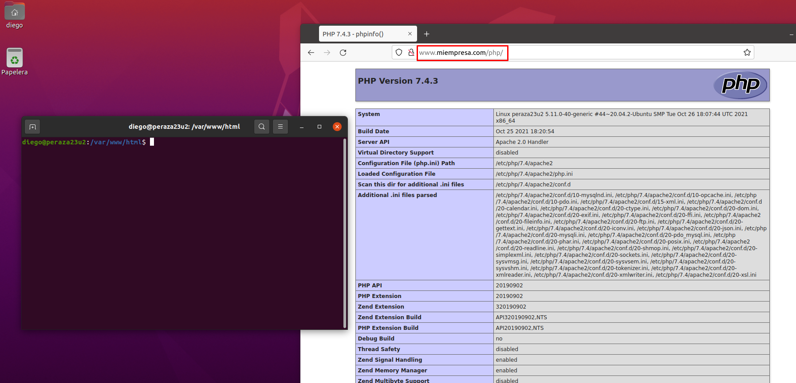
