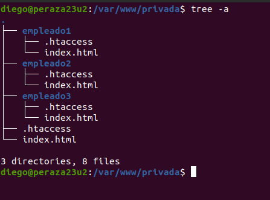
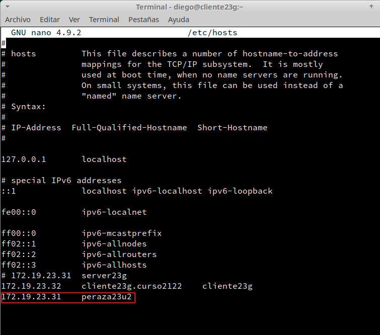
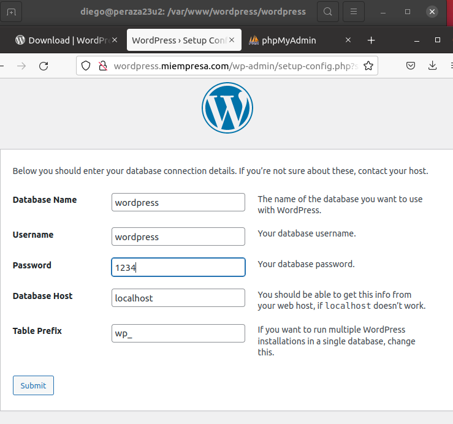

# **Práctica Servidor Web Apache - Linux**

### **Configurar MV Ubuntu o similar en adaptador Puente**

### **Apache**

- **Instalar Apache:**

- **Comprobar la carpeta raíz sitio web.**

- **Comprobar acceso a localhost o 127.0.0.1:**

- **Editar el fichero `/etc/hosts` y añadir la siguiente línea.**

- **Reiniciamos Apache.**

- **Comprobar acceso.**

- **Error + Access logs:**

### **PHP**

- **Instalar PHP 7.4 y el paquete `libapache2-mod-php7.4`:**

- **Comprobar acceso a index.php:**

### **Crear Hosts Virtuales**

- **En este punto asociaremos carpetas con sitios web y modifciaremos el archivo `/etc/apache2/sites-available/000-default.conf`.**

- **Pondremos el ``ServerName`` que acabamos de poner en el fichero de configuración , en el archivo de ``/etc/hosts``.**

- **Comprobamos de que hay un index.html creado en la carpeta ``/var/www/empleados``.**

- **Comprobamos en el navegador web poniendo ``empleados.miempresa.com``.**

### **Configurar sitio web seguro `pagos`**

- **Generamos certificado autofirmado y creamos una carpteta `/etc/apache2/ssl` y dentro de esta carpeta meteremos los siguientes ficheros generados:**

- **Crearemos un archivo de configuración nuevo que solo estará el Host Virtual ``pagos``.**

- **Habilitamos el módulo SSL Apache y el sitio ``pagos``.**

- **Comprobamos que hay contenido en la carpeta `/var/www/empleados/pagos`**

- **Reiniciamos Apache:**

- **Comprobamos en el navegador web.**

### **Acceso a carpetas privadas**

- **Autenticación mediante ``.htaccess``:**

- **Carpeta Claves:**

- **Archivo de configuración de empleados:**

- **Comprobación en el navegador web.**

 - **Empleado 1**

 -**Empleado 2**

 - **Empleado 3**

### **MySQL**

- **Instalamos MySQL:**

**- Instalar soporte php para MySQL:**

### **phpMyAdmin**

- **Descargar la última versión (tar.gz) , descomprimiremos en `/var/www/phpMyAdmin`, asociada a un Host Virtual y comprobaremos el acceso.**

- **Si nos sale como un error o que nos falta algo por instalar, seguramente sea que no tenemos instalado algunos de los paquetes siguientes:**

  - `sudo apt-get install php7.4-mysqli`
  - `sudo apt-get install php7.4-xml`

### **Plataforma WordPress / Drupal / Joomla / Moodle / etc**

- **Creación de base de datos y usuarios necesarios.**

- **Instalación y configuración de SSH para acceso remoto desde cliente.**

- **Descarga, instalación y configuración plataforma WordPress.**

