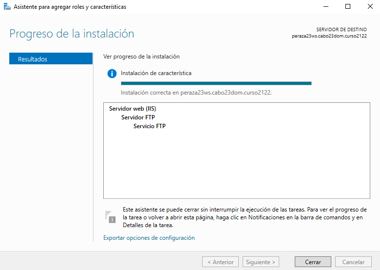
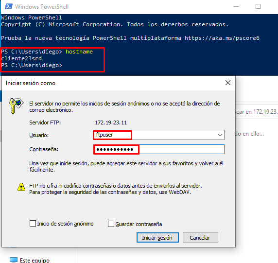

# **Informe FTP - Prácticas Windows y Linux**

## - **Instalación y Configuración de un Servidor FTP - Windows**

#### **1. Instalar Servicio FTP en Windows 2016 Server, a través de Agregar roles y características (IIS)**

#### **2. Acceder a la creación y configuración de Sitios FTP por medio de la Administración de IIS.**

- **Aislamiento de usuario FTP:** a fin de definir el modo de aislamiento de usuario para el sitio FTP. El aislamiento de usuario FTP es una solución que permite a los proveedores de acceso a Internet (ISP) ofrecer a sus clientes directorios FTP individuales para cargar contenido.

- **Autenticación FTP:** configurar los métodos de autenticación que los clientes FTP pueden utilizar para obtener acceso al contenido. Puede ordenar esta lista por nombre, estado o tipo haciendo clic en el encabezado de columna adecuado.

- **Compatibilidad con el firewall de FTP:** a fin de modificar la configuración de las conexiones pasivas cuando los clientes FTP se conecten a un servidor FTP ubicado detrás de un firewall.

- **Configuración SSL de FTP:** a fin de administrar el cifrado para las transmisiones de canal de control y canal de datos entre el servidor FTP y los clientes.

- **Examen de directorios FTP:** a fin de modificar la configuración de contenido para examinar un directorio en el servidor FTP. Cuando se configura el examen de directorios, todos los directorios usan la misma configuración.

- **Filtrado de solicitudes de FTP:** definir la configuración del filtrado de solicitudes para su sitio FTP. El filtrado de solicitudes de FTP es una característica de seguridad que permite a los proveedores de acceso a Internet (ISP) y a los proveedores de servicios de aplicaciones restringir el comportamiento de los protocolos y del contenido.

- **Mensajes de FTP:** modificar la configuración de los mensajes que se envían cuando un usuario se conecta a su sitio FTP.

- **Registro FTP:** para configurar las características de registro en el nivel de sitio o servidor, y para configurar los valores de registro.

- **Reglas de autorización:** configurar reglas para autorizar a los usuarios a obtener acceso a sitios FTP.

- **Restricciones de direcciones IPv4 y dominios de FTP:** definir y administrar reglas que permitan o denieguen el acceso al contenido de una dirección IPv4, un intervalo de direcciones IPv4 o un nombre o nombres de dominio específicos.

- **Restricciones de intento de inicio de sesión de FTP:** característica para proteger el servidor FTP frente ataques basados en red.

#### **3. Crear tres nuevos sitios FTP (en todos ellos se debe poder acceder a través de las IPs del servidor y, en algún caso, de un nombre DNS ftp.tudominio.ext)**

- **Sitio Web 1 - FTP**

Creamos y configuramos el sitio web 1 - FTP:

Tratamos de acceder al sitio web:

  - Consola

  - Explorador de archivos

  - Navegador Web

  - Navegador Web - Cliente

  - Explorador de archivos - Cliente

  - WinSCP - Cliente

Instalación del software WinSCP

Establecemos la conexión

****
**OJO!! DETENDREMOS EL SITIO WEB 1 PARA QUE EL SIGUIENTE SITO WEB FUNCIONE CORRECTAMENTE**
****

- **Sitio Web 2 - FTP**

Creamos y configuramos el sitio web 2 - FTP:

Creamos un usario que pertenezca al dominio

Tratamos de acceder al sitio web:

  - Explorador de archivos

  - Navegador web

  - Explorador de archivos - Cliente

  - Navegador web - Cliente

  - Conexión SSL desde WinSCP - Cliente

****
**OJO!! DETENDREMOS EL SITIO WEB 2 PARA QUE EL SIGUIENTE SITO WEB FUNCIONE CORRECTAMENTE**
****

- **Sitio Web 3 - FTP**

Creamos y configuramos el sitio web 3 - FTP:

Cambiamos el nombre de host:

- Creamos un nuevo host en nuestro dominio `miEmpresa.com`.

- Comprobamos desde cliente:

No podremos escribir ni borrar nada, pero si leer.

- Comprobamos desde servidor:

#### **4. En un principio es posible que debas detener un sitio ftp para que pueda iniciarse otro. Tras comprobar el funcionamiento por separado de los sitios, encontrar una solución para que nuestro servidor ofrezca varios sitios FTP simultáneamente.**

- Para ello pondremos un puerto diferente a casa sitio web.

