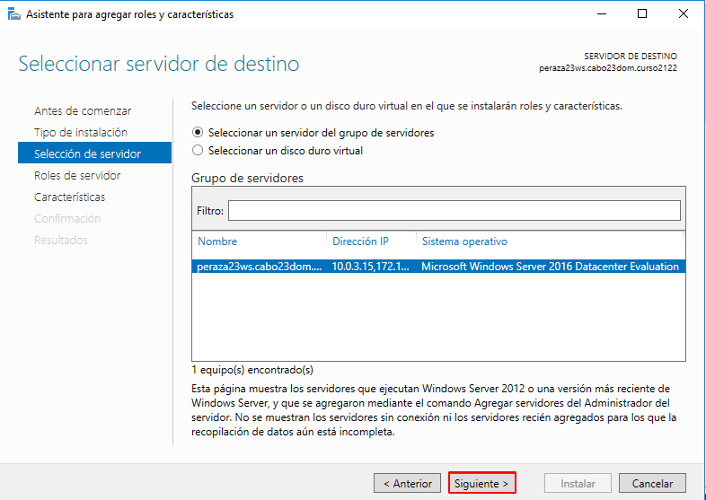
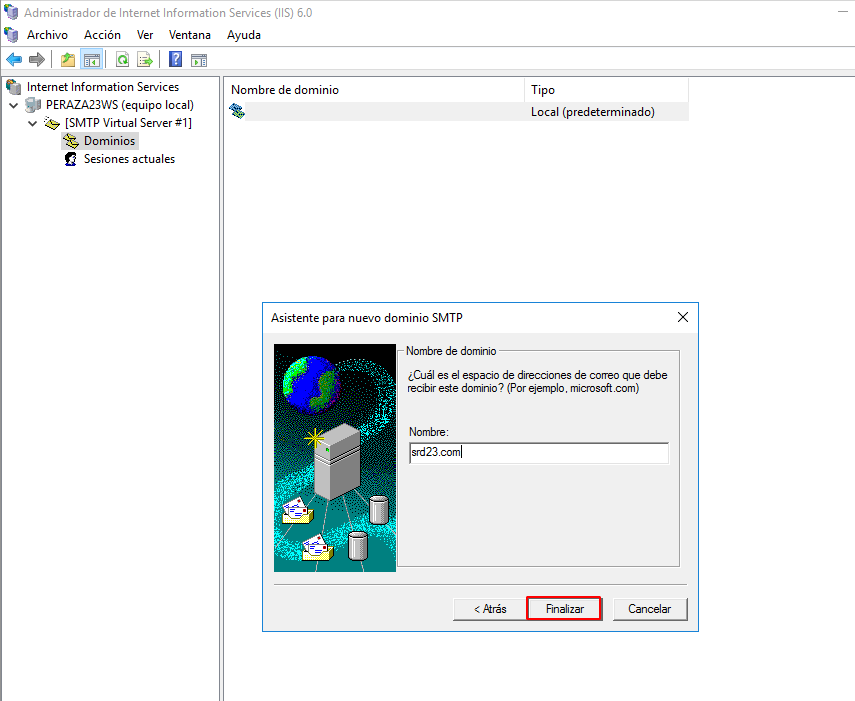
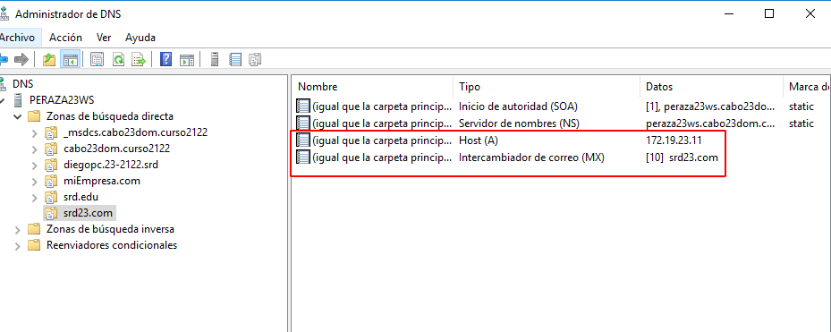
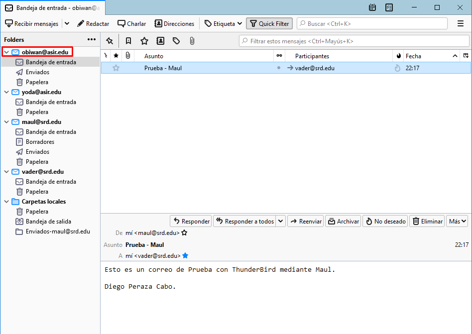
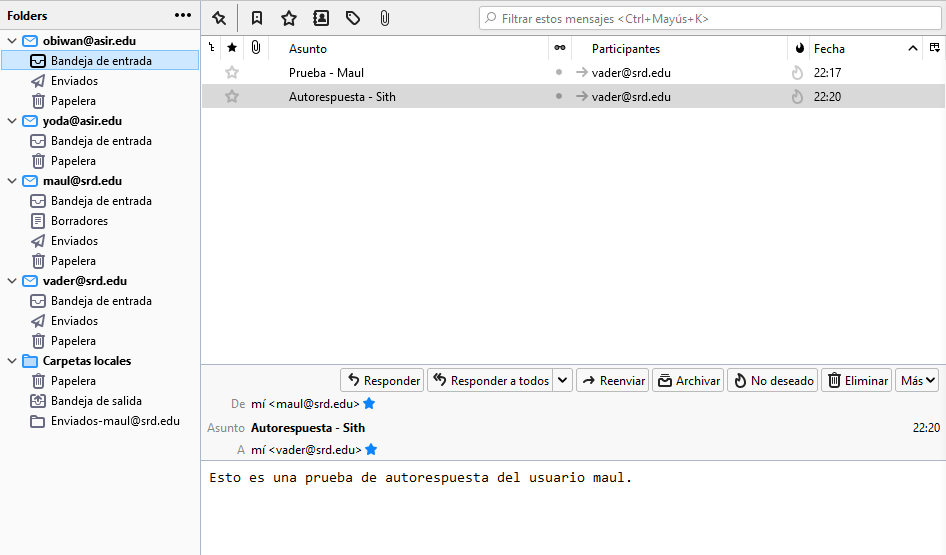

# **Instalación y Configuración de Servicios de Correo Electrónico en Windows 2016 Server**

***Nombre:*** Diego Peraza Cabo
 
***Curso:*** 2º ASIR

## **Índice** 

  + [Instalación y Configuración de un Servidor de Correo SMTP](#1)
  + [Instalación y Configuración de hMailServer](#2)

### **Instalación y Configuración de un Servidor de Correo SMTP** 

#### **1. Instalación Servicio SMTP en Windows 2016 Server**

#### **2. Configuración del Servicio SMTP**

- Una vez instalado el servicio SMTP, realizaremos las siguientes acciones para realizar la configuración del mismo.

- Establecer como IP todas las asignadas.
- Limitar el número de conexiones a 50.
- Habilitar el registro en formato W3C, diario y en una carpeta determinada.

- Configurar envío de mensajes dentro de nuestra red local.

- Establecer autenticación anónima.

- Aplicamos los cambios.

- Crea un dominio de tipo alias para disponer de cuentas en otro dominio.

- Comprobamos las carpetas de correo creados en ``C:\Inetpub\mailroot``.

#### **3. Creamos una nueva zona de búsqueda directa.**

#### **3.1. Comprobamos desde el cliente el acceso al nuevo nombre DNS creado en el servidor.**

#### **4. Agregamos dos usuarios AD**

#### **5. Enviamos varios correos desde / hacia las diferentes cuentas y comprobar envío**

#### **6. Establecemos autenticación básica de Windows.**

#### **7. Enviamos varios correos a cuenta personal de correo y a un usuario que no existe**

[Volver](#0)

### **Instalación y Configuración de hMailServer**

#### **1. En primer lugar, hay que desinstalar el servicio SMTP de Windows 2016 Server.**

#### **2. Debes descargar e instalar en el servidor Windows 2016 server el servidor de correo hMailServer.**

- Vemos que nos da un error al instalar el hMailServer asociado a la característica de .NET Framework 2.0. Para solucionar este problema instalaremos está característica en el servidor.

- Ahora ya podremos instalar el hMailServer.

- Pondremos una contraseña y finalizamos la instalación.

#### **3. Crea dos dominios denominados srd.edu y asir.edu.**

#### **4. Ejecuta los diagnósticos para ambos dominios y soluciona el error de backup asignando una carpeta para tal fin. Establece copia de seguridad de los mensajes.**

#### **5. Crea dos cuentas para dos usuarios ficticios en cada uno de los dos dominios. Investiga y configura las cuentas con diferentes opciones (cuota de disco, auto-reply, forwarding, signature, etc.)**

- Yoda

- Maul

- Vader

#### **6. Configura el servicio DNS para crear las entradas mail.srd.edu y mail.asir.edu que apunten a la dirección ip del servidor windows 2016.**

#### **7. Realiza todas las opciones de configuración que consideres necesarias y/o convenientes. Consulta para ello los tutoriales cuyos enlaces se proporcionan (opciones de protocolos SMTP, POP e IMAP, rangos de IP, bloqueo de correo entrante, nombre de host, reenvío dominios remotos, blacklists, opciones de logging, etc.)**

- Configuraremos las opciones del servidor más convenientes.

- Creamos un rango de Ip's.

- Ponemos mensajes de bienvenida a los protocolos.

- **SMTP**

- **IMAP**

- Cambiamos el puerto del protocolo POP3.

- Añadimos los logs de los protocolos.

- Para hacer la comprobación necesitaremos instalarnos la característica `Cliente Telnet`.

- Comprobamos.

SMTP

POP3

IMAP

Logs

- Ponemos el local hostname.

#### **8. Configura en el cliente Windows un cliente de correo como thunderbird o Live Mail (en los ordenadores clientes) para acceder al servidor de correo instalado en Windows 2016.**

- Iniciamos sesión con todos los usuarios.

- Nos saldrá siempre el siguiente aviso pero le damos a que Aceptamos los riesgos y confirmamos.

- Comprobamos de que están todas las cuentas.

#### **9. Realiza prueba de envío y recepción de correos entre los diferentes usuarios, comprobando, además de envío y recepción correctas, el efecto de las opciones configuradas en las cuentas.**

Obiwan

Maul

Vader

- Esperamos un poco para la autorespuesta.

#### **10. Crea una lista de distribución empleados asociada al dominio y añade a los dos usuarios de miempresa.com a ella.**

#### **11. Realiza prueba de envío y recepción de correos por medio de la lista de distribución.**

Hasta aquí queda por concluida la actividad.

[Volver](#0)
