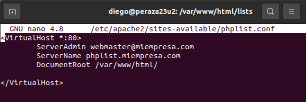

# **Listas de distribución**

***Nombre:*** Diego Peraza Cabo
 
***Curso:*** 2º ASIR

## **Índice** 

+ [1. Instalación de la aplicación phpList en un entorno Ubuntu Server con Apache, php y MySQL.](#1)
+ [2. Investigar sobre las principales opciones de configuración y mantenimiento.](#2)
+ [3. Buscar información sobre los usos y potenciales de phpList. ¿Para que sirve? ¿Qué le ofrece a una empresa la utilización de esta aplicación?](#3)
+ [4. Realizar acciones](#4)
  + [4.1 Incluir nuevos usuarios](#4.1)
  + [4.2 Crear una lista e incluir miembros en ella](#4.2)
  + [4.3 Crear una página home de suscripción a una lista](#4.3)
  + [4.4 Crear una campaña](#4.4)

### **1. Instalación de la aplicación phpList en un entorno Ubuntu Server con Apache, php y MySQL.** 

- Primero que nada comprobamos que nuestro entorno de Ubuntu Server tiene instalado correctamente: Apache, php y MySQL.

  

- Una vez hecho el paso anterior, nos descargaremos la aplicación phpList.

  

  

  

- Descomprimimos el archivo comprimido de phpList.

  

- Movemos la carpeta `phplist-3.6.6` al directorio `/var/www`con el nombre `phplist`.

  

- Cambiamos los permisos de la carpeta.

  

- Cambiaremos el nombre de la carpeta `public_html` a `html`, además la movemos a `/var/www` y le pondremos de propietario `root` y a sus subcarpetas.

  

- Ahora creamos la base de datos que vamos a utilizar y modificamos el fichero `config.php`.

  

  

- Además le pondremos el idioma en Español. Aunque también se puede hacer añadiendo la siguiente línea: `$language_module = "spanish.inc";`.

  

- Si queremos acceder a phpList hay dos maneras por localhost o creando un virtualhost, yo lo hice por localhost pero si lo quieres hacer de la otra manera, tendremos que crear el virtual host en `/etc/apache2/sites-available`, con el siguiente contenido:

  

- Habilitamos el sitio y reiniciamos el servicio de `apache2`.

  

- Comprobamos de que el sitio web ha sido habilitado.

    

- Añadimos en el fichero `/etc/hosts` el virtualhost.

  

- Entramos al navegador web y pondremos lo siguiente: `localhost/lists/admin` y pasaremos con la instalación.

  

  

  

- Ya terminada la instalación, iniciaremos sesión y entramos a phpList para realizar las acciones que queremos hacer.

  

- Vemos que también podemos entrar poniendo la siguiente URL `phplist.miempresa.com`.

  

  

[Volver](#0)

### **2. Investigar sobre las principales opciones de configuración y mantenimiento.** 

- **Las principales opciones de configuración y mantenimiento son:**

  - **Configuraciones principales para la base de datos:**

    - *$database_name*
    - *$database_user*
    - *$database_password*

  - **Configurar idioma:**
    - *$language_module*

  - **Configurar los rebotes:**
    - *$message_envelope*
    - *$bounce_mailbox_host*
    - *$bounce_mailbox_user*
    - *$bounce_mailbox_password*

  - **Configurar para evitar ser considerado spammer:**

    - *define(«MAILQUEUE_BATCH_SIZE»,0); //Número de emails por periodo*
    - *define(«MAILQUEUE_BATCH_PERIOD»,3600); //El periodo en segundos aqui 1 hora*
    - *define(‘MAILQUEUE_THROTTLE’,15);//Pausa entre emails en segundos (240 emails por hora)*

  - **Configurar si no queremos que aparezca el ``powered by`` en nuestros emails:**

    - *define («REGISTER»,0);*

[Volver](#0)

### **3. Buscar información sobre los usos y potenciales de phpList. ¿Para que sirve? ¿Qué le ofrece a una empresa la utilización de esta aplicación?** 

- **phpList** es un software de código abierto que nos permite crear listas de distribución de correo para efectuar envíos masivos de email.

- Se emplea principalmente para la divulgación de información mediante envío de boletines, novedades o simplemente publicidad.

[Volver](#0)

### **4. Realizar acciones dentro del phpList.** 

##### **4.1 Incluir nuevos usuarios** 

- Para incluir nuevos usuarios, tendremos que ir al Inicio y darle click a `Import Subscribers`.

  

- Incluimos los usuarios que queramos y le daremos a `Import emails`.

  

- Vemos que se han incluido los usuarios correctamente.

  

##### **4.2 Crear una lista e incluir miembros en ella** 

  

  

- Comprobamos que se ha creado correctamente.

  

- Ahora vamos a incluir miembros en ella.

  

  

  

- Incluimos los emails que queramos.

  

- Comprobamos que se han agregado correctamente los miembros a la lista.

  

##### **4.3 Crear una página home de suscripción a una lista** 

- Nos dirigimos al menú de la parte izquierda y vamos a `Opciones de configuración` y le daremos click a `Crear una nueva página de suscripción`.

  

  

- La modificamos como queramos y le damos a guardar.

  

  

- Comprobamos que se ha creado bien la página.

  

  

- Para solucionar el error anterior, tendremos que eliminar el archivo``index.html`` o cambiarle el nombre. También se puede arreglar dandole prioridad al fichero ``index.php``.

  

  

- Nos suscribimos a nuestra página y comprobamos.

  

  

##### **4.4 Crear una campaña** 

  

  

  

  

  

  

  

  

  

  

  

[Volver](#0)
