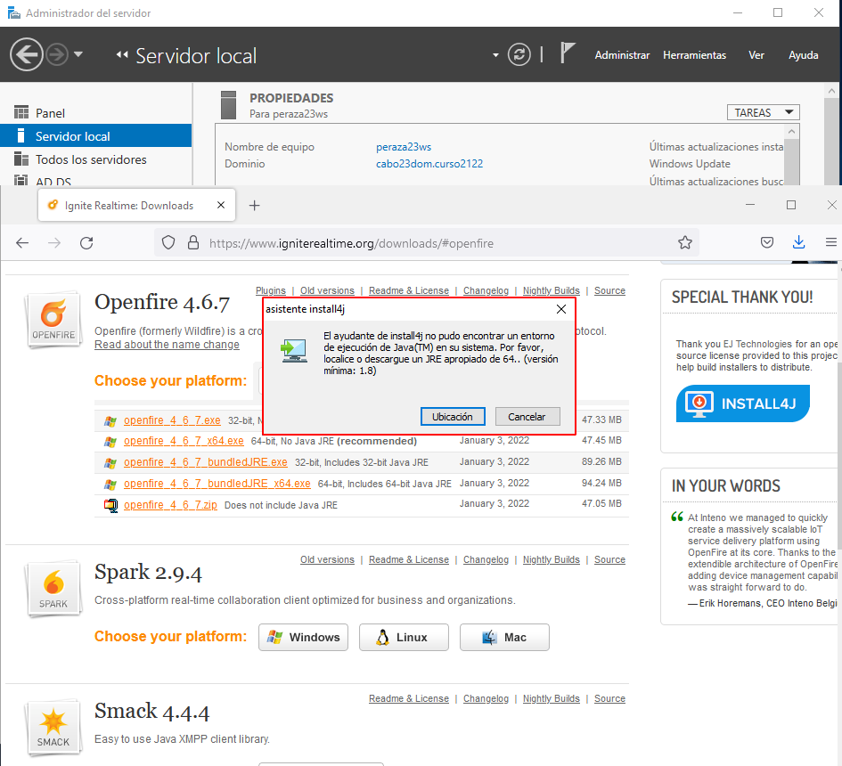

# **Instalación y Configuración de un Servidor de Mensajería Instantánea en Windows 2016 Server**

***Nombre:*** Diego Peraza Cabo
 
***Curso:*** 2º ASIR

## **Índice** 

  + [1. Comprobar que en tu servidor Windows 2016 están instalados y funcionan correctamente: IIS, PHP, MySQL y phpMyAdmin.](#1)
  + [2. Descargar e instalar el servidor de mensajería instantánea OpenFire para Windows.](#2)
  + [3. Crear una base de datos en blanco en MySqQL a través de phpMyAdmin y recordar nombre de la BD, así como usuario y contraseña con privilegios.](#3)
  + [4. Ejecutar el script de instalación de Openfire desde un navegador web del servidor, mediante la url ``http://127.0.0.1:9090``. (openfire trabaja con los puertos 9090 y 9091 –https-).](#4)
  + [5. Instalación y Configuración de OpenFire.](#5)
  + [6. Comprobamos desde el servidor el acceso con el usuario admin.](#6)
  + [7. Una vez instalado el servidor OpenFire, vamos a descargar e instalar un cliente de Mensajería, en este caso Spark.](#7)
  + [8. Ahora vamos a crear dos nuevos usuarios en OpenFire (además del administrador) para poder mantener una conversación entre cliente y servidor](#8)
  + [9. Comprobamos el funcionamiento de Spark](#9)

### **1. Comprobar que en tu servidor Windows 2016 están instalados y funcionan correctamente: IIS, PHP, MySQL y phpMyAdmin.** 

- Comprobamos que tenemos instalado IIS, yendo a `Administración del servidor -> Herramientas`, y nos saldrá la herramienta `Administador de IIS`. En los pasos siguientes se comprobará su funcionamiento.

  

- Comprobamos que tenemos instalado PHP, creando un sitio web, que de carpeta raíz tenga una cualquiera, pero que contenga un archivo con el siguiente contenido: `<?php phpinfo();?>`

  

- Para comprobar que tenemos instalado MySQL, entramos por línea de comandos y vemos la versión que tenemos.

  

- Entramos a `phpmyadmin.miempresa.com` para comprobar tres cosas, el funcionamiento de ISS, el de MYSQL y el de phpMyAdmin.

  

  

[Volver](#0)

### **2. Descargar e instalar el servidor de mensajería instantánea OpenFire para Windows.** 

  

  

  

  

- Vemos que necesitamos descargarnos un programa para seguir con la instalación

  

- Para la instalación de OpenFire nos tendremos que instalar el programa `install4j`.

  

  

  

  

  

  

  

  

  

- Una vez instalado el programa `install4j`, seguiremos con la instalación de OpenFire y le daremos a `Ubicación`. Tendremos que buscar en la carpeta del programa, el ejecutable `java.exe`.

  

  

- Seleccionamos el idioma `Español`.

  

  

- Aceptamos los términos de licencia.

  

  

  

- Esperamos a que se instale.

  

- Iniciamos el servicio y pasaremos después con la configuración de OpenFire mediante el URL `http://localhost:9090`.

    

[Volver](#0)

### **3. Crear una base de datos en blanco en MySqQL a través de phpMyAdmin y recordar nombre de la BD, así como usuario y contraseña con privilegios.** 

  

  

  

  

[Volver](#0)

### **4. Ejecutar el script de instalación de Openfire desde un navegador web del servidor, mediante la url ``http://127.0.0.1:9090``. (openfire trabaja con los puertos 9090 y 9091 –https-).** 

  

    

[Volver](#0)

### **5. Instalación y Configuración de OpenFire.** 

- Elegimos el idioma `Español`

  

- El dominio y los puertos se pondrán automáticamente, asi que le daremos a `Continuar` sin cambiar nada.

  

- Seleccionamos `Conexión Estándard` y continuar.

  

- En el paso siguiente que es la `Configuración de la fuente de datos`, tendremos que tener puesto en `Drivers Predefinidos -> MySQL`, en la URL de la base de datos , pondremos lo siguiente: `jdbc:mysql://localhost:3306/openfire`, y en el usuario tiene que ser el user con privilegios, en este caso pondremos `root` con su respectiva contraseña.

- En la configuración de perfil, la pondremos por defecto.

  

- Pondremos la cuenta del administrador que vamos a utlizar para iniciar sesión en `Openfire`.

  

- Veremos en la base de datos de openfire que hemos creado nosotros, que el usuario que se ha guardado es el ``admin``, en vez de ``admin_diego``.

  

- La verdad que nose el porque pero inicaremos sesión con el nombre de usuario ``admin`` y la contraseña que pusimos en el paso final de la cuenta del administrador.

  

  

[Volver](#0)

### **6. Comprobamos desde el servidor el acceso con el usuario admin.** 

  

  

[Volver](#0)

### **7. Una vez instalado el servidor OpenFire, vamos a descargar e instalar un cliente de Mensajería, en este caso Spark.** 

  

  

  

  

  

  

  

[Volver](#0)

### **8. Ahora vamos a crear dos nuevos usuarios en OpenFire (además del administrador) para poder mantener una conversación entre cliente y servidor** 

  

  

  

  

  

[Volver](#0)

### **9. Comprobamos el funcionamiento de Spark** 

- Antes de nada tenemos que hacer lo siguiente:

  - Iniciamos sesión con el usuario pepe en el servidor y nos saldrá lo siguiente:

    

    

  - Vemos que nos sale el siguiente error:

    

  - Para solucionarlo, tedremos que ir a la parte de abajo y seleccionar `Avanzado`, una vez hecho esto, se nos abrirá una ventana de la Configuración Avanzada de Spark.

    

  - Iremos a la parte de seguridad, `Security` y activamos la siguiente opción:

    

- Este paso lo realice con un compañero de clase , Salvador Gónzalez , él me ayudo a establecer una conversación con el usuario benito, con lo cuál él actuaba como cliente y yo como servidor.

  

- Le envió la solicitud de amistad.

  

  

  

- Una vez hemos aceptado los dos la solicitud de amistad, los usuarios saldrán en línea.

  

  

- Establecemos una conversación con lo usuarios creados anteriormente.

  

  

[Volver](#0)
