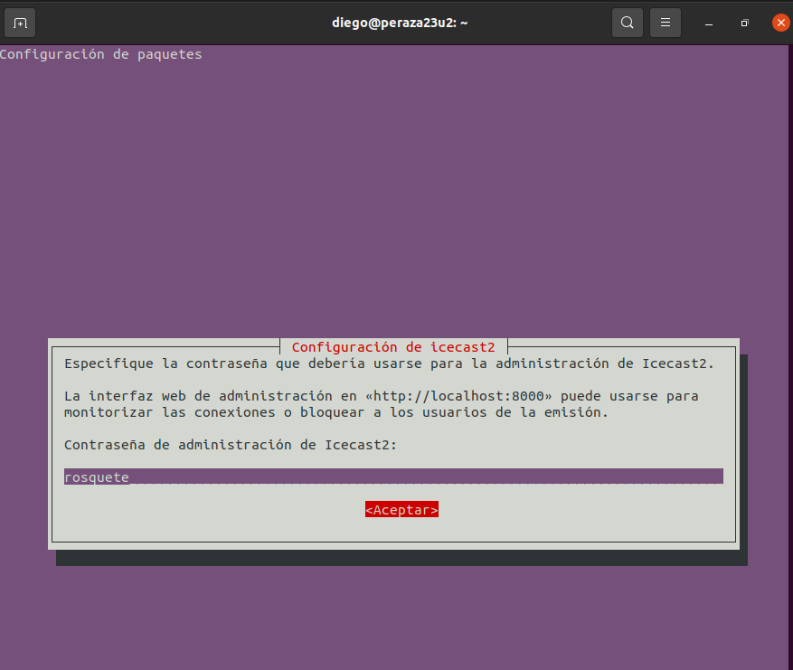
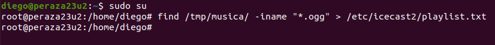

# **Instalación y Configuración de un Servidor Multimedia (Audio) en Linux**

***Nombre:*** Diego Peraza Cabo
 
***Curso:*** 2º ASIR

## **Índice** 

  + [1. Instalación y configuración de IceCast](#1)
  + [2. Instalación y configuración de Vorbis Ices2](#2)
  + [3. Comrpobamos su funcionamiento desde el servidor](#3)
  + [4. Comprobamos su funcionamiento desde el cliente](#4)
  + [5. Investigación](#5)

### **1. Instalación y configuración de IceCast** 

- Descargamos e instalamos y configuramos el paquete `Icecast`.

  

- Durante la instalación nos saldrá un menu de sí queremos configurar ahora el paquete. En mi caso le di a que sí pero puedes configurarlo más tarde perfectamente.

  

  

  

  

  

- No nos hará falta editar el fichero `/etc/icecast2/icecast.xml` si realizamos la configuración anterior.

- Podemos ver que si hacemos el paso anterior se guardan los datos que introducimos.

  

- Editamos el fichero ``/etc/default/icecast2``.

  

- Iniciamos el servicio correspondiente a IceCast y comprobamos su estado.

  

[Volver](#0)

### **2. Instalación y configuración de Vorbis Ices2** 

- Descargamos e instalamos el paquete `Vorbis Ices2`.

  

- Creamos el directorio `/etc/ices2` para el codificador y copiamos el fichero de configuración por defecto.

  

- Editamos el fichero de configuración del codificador que acabamos de copiar y establecemos los parámetros de nuestra emisora mediante las siguientes etiquetas:

  

  

- Ahora tendremos que recopilar ficheros de audio en formato .ogg y copiarlos en el directorio `/tmp/musica` que vamos a crear.

  

- Generamos la lista de reproducción.

  

- Creamos el directorio log de ices2 y ejecutamos el codificador en background.

  

- Si vemos que nos sale `unable to open log /var/log/ices/ices.log`, solo tendremos que cambiar la siguiente línea del fichero de configuración.

  

- Comprobamos.

  

[Volver](#0)

### **3. Comrpobamos su funcionamiento desde el servidor** 

- Procedemos a acceder al navegador web con la siguiente URL `miempresa.com:8000/admin/`.

  

- Comprobamos las opciones globales del servidor.

  

- Comprobamos el punto de montaje.

  

- Accedemos vía web a la lista de reproducción desde el propio servidor.

  

[Volver](#0)

### **4. Comprobamos su funcionamiento desde el cliente** 

  

  

[Volver](#0)

### **5. Investigación** 

[Volver](#0)
