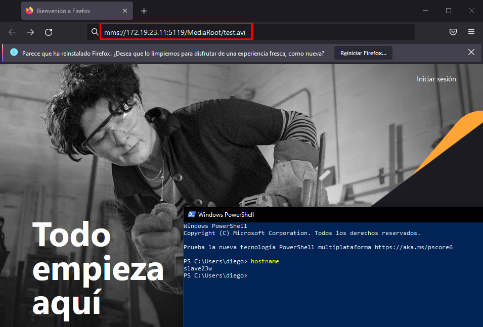

# **Instalación de un servicio de Streaming en Windows 2016 Server**

***Nombre:*** Diego Peraza Cabo
 
***Curso:*** 2º ASIR

## **Índice** 

  + [1. Instalación de Unreal Media Server](#1)
  + [2. Comprobación en el servidor](#2)
  + [3. Comprobación en el cliente](#3)

### **1. Instalación de Unreal Media Server** 

- Descargamos el programa `Unreal Media Server` en la siguiente página web.

  

  

- Seleccionamos el destino que queramos para extraer los archivos. En mi caso puse `C:\UMediaServer`.

  

- Vamos a la carpeta donde se ha descomprimido todos los archivos y daremos click al ejecutable.

  

- Le daremos a ejecutar y pasaremos con la instalación de `Unreal Media Server`. Seguiremos los pasos indicados en las fotos.

  

- Le damos a `Next`.

  

- Aceptamos los términos y condiciones.

  

- Dejamos la ubicación que hay por defecto.

  

- Le damos a `Next`.

  

- Esperamos a que se instale.

  

  

- Una vez hemos instalado el programa, daremos click al símbolo de Windows y buscamos el programa para iniciarlo.

    

- Una vez dentro del programa, vemos que en la carpeta `File resources -> MediaRoot` tenemos dos archivos de prueba. En esta carpeta podremos poner los videos que queramos pero solo se mostrarán los videos que tengan de formato `.avi`.

    

[Volver](#0)

### **2. Comprobación en el servidor** 

- Entramos en la siguiente URL: `mms://IP-DEL-SERVIDOR/MediaRoot/test.avi`, y elegimos el `Reproductor de Windows Media`.

  

  

- Comprobamos.

  

[Volver](#0)

### **3. Comprobación en el cliente** 

- Para hacer la comprobación desde el cliente, primero tenemos que descargarnos `VLC` o algún programa parecido.

- Una vez realizado el paso anterior, vamos al navegador web `Firefox` y pondremos la siguiente URL `mms://IP-DEL-SERVIDOR/MediaRoot/test.avi`.

    

- Elegimos `VLC` como aplicación para abrir el vídeo.

    

- Comprobamos.

    

[Volver](#0)
