# **Instalación y configuración del Servicio VoIP en Linux**

***Nombre:*** Diego Peraza Cabo
 
***Curso:*** 2º ASIR

  

## **Índice** 

+ [1. Instalación de ``Asterisk``](#1)
+ [2. Configuración de ``Asterisk``](#2)
+ [3. Instalación de ``MicroSIP`` en Cliente Windows](#3)
+ [4. Instalación y configuración de ``MizuDroid SIP VOIP Softphone`` en el teléfono móvil](#4)
+ [5. Comprobación del funcionamiento de Asterisk con los clientes](#5)

### **1. Instalación de Asterisk** 

- Instalamos el programa.

  

  

- Comprobamos que podemos entrar al programa.

  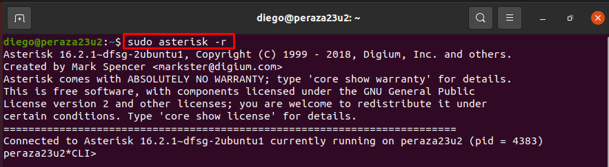

- Comprobamos los archivos de configuración en el directorio `/etc/asterisk`.

  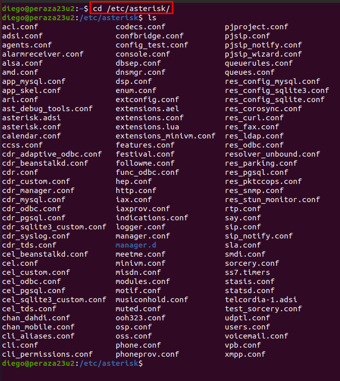

[Volver](#0)

### **2. Configuración de Asterisk** 

- Una vez hemos realizado los pasos anteriores, pasaremos con la configuración. Para ello cambiamos el nombre de los archivos siguientes con la terminación `.backup` y creamos unos nuevos con el nombre que tenían antes.

  - Fichero `sip.conf`

    

    - Contenido

      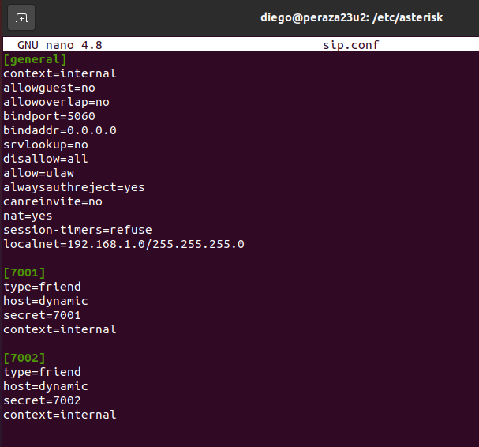

  - Fichero `extensions.conf`

    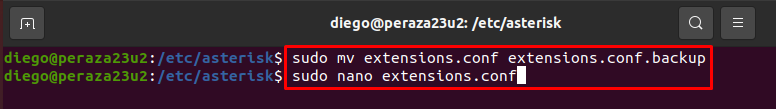

    - Contenido

      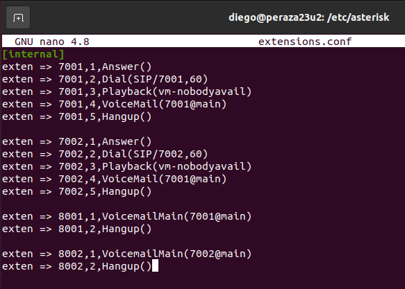

  - Fichero `voicemail.conf`

    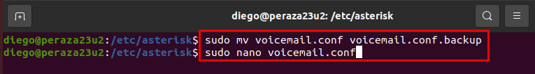

    - Contenido

      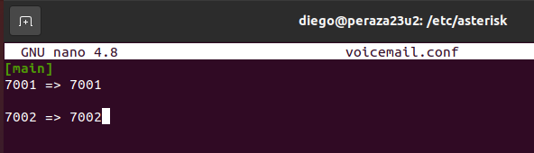

- Cunado hayamos terminado de configurar todo, entramos al programa y hacemos un `reload` para que cargue los ficheros de configuración que hemos creado.

  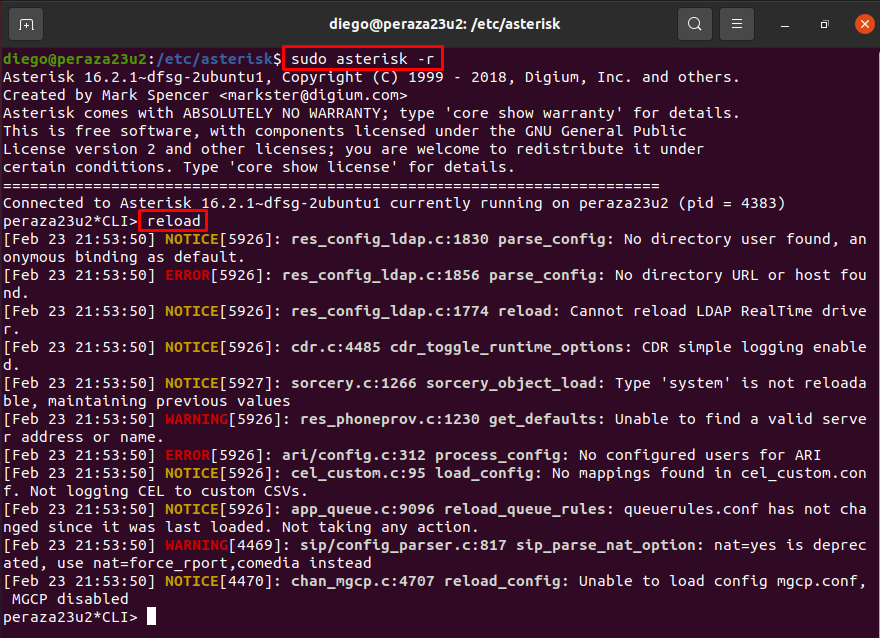

- Salimos y volvemos a entrar al programa, y comprobamos los clientes con el siguiente comando: `sip show peers`.

  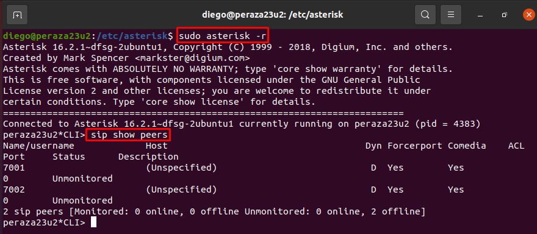

[Volver](#0)

### **3. Instalación de MicroSIP en Cliente Windows** 

- Vamos a la máquina cliente y descargamos e instalamos el programa.

  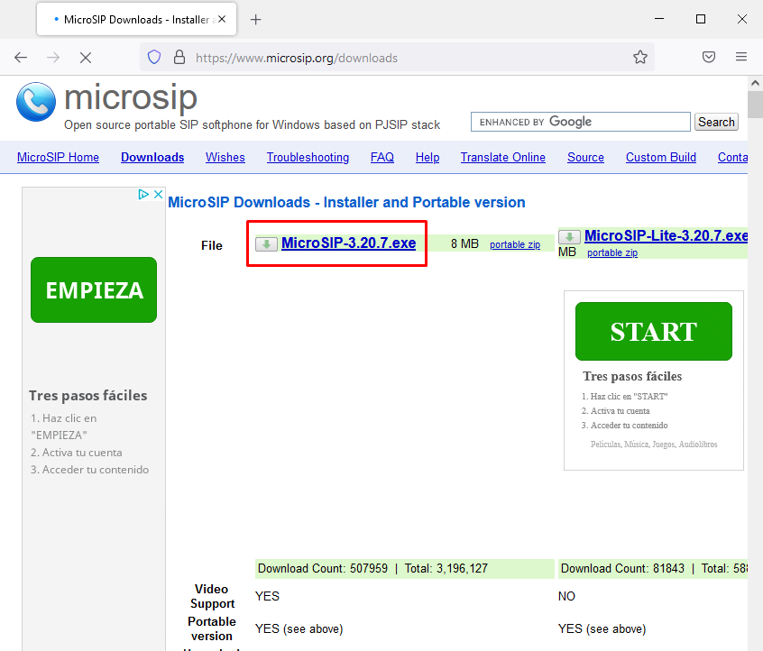

- Una vez dentro del programa pondremos una cuenta con los siguientes datos. Una vez hemos puesto todos los datos necesarios le damos a `Guardar`.

  

- Comprobamos de que nos hemos conectado correctamente.

  

[Volver](#0)

### **4. Instalación y configuración de ``MizuDroid SIP VOIP Softphone`` en el teléfono móvil** 

- Vamos a la ``Play Store`` , buscamos e instalamos el programa.

  

- Entramos a la aplicación.

  

- Ponemos los datos necesarios, como la dirección IP del servidor, el usuario y la contraseña.

  

- Una vez puesto todos los datos, nos saldrá que estamos logeados correctamente, ya que pone `Registered` en la parte superior izquierda.

  

[Volver](#0)

### **5. Comprobación del funcionamiento de Asterisk con los clientes** 

- Ahora llamamos al cliente Windows con el cliente del móvil, indicando el número de la extensión.

  

  

- Comprobamos en el cliente Windows y en el servidor Linux de que está recibiendo la llamada.

  

- Aceptamos la llamada y vemos que cuando hablamos emite sonido.

  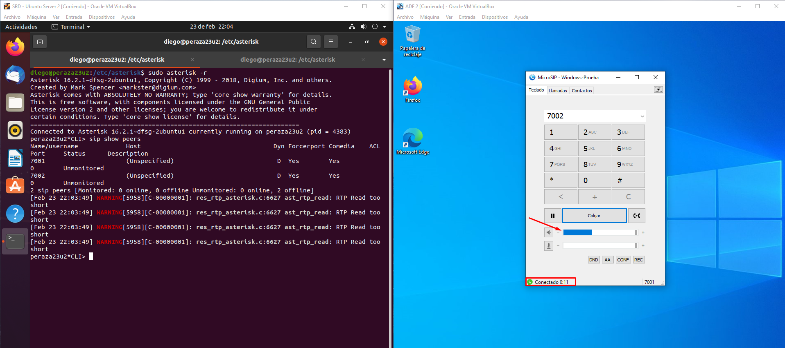

- Por último, iremos al programa de `Asterisk` en el Servidor y comprobamos que en los clientes (peers), se nos ha puesto la dirreción IP de los dispositivos.

  

[Volver](#0)
