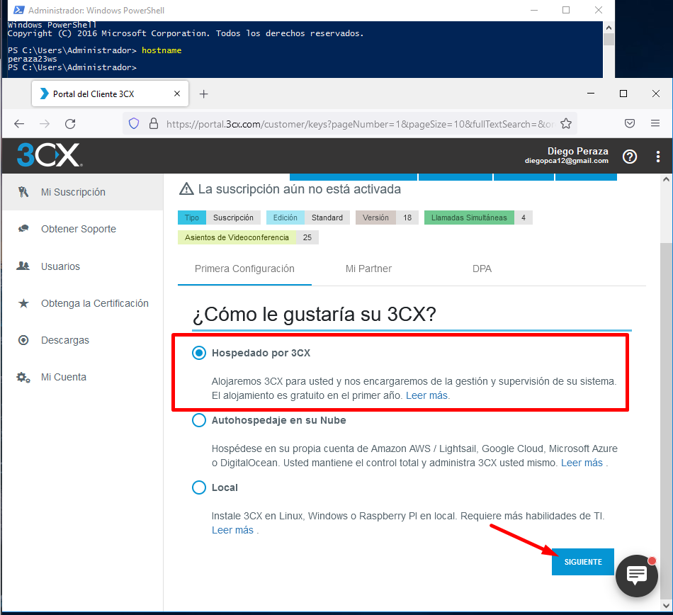
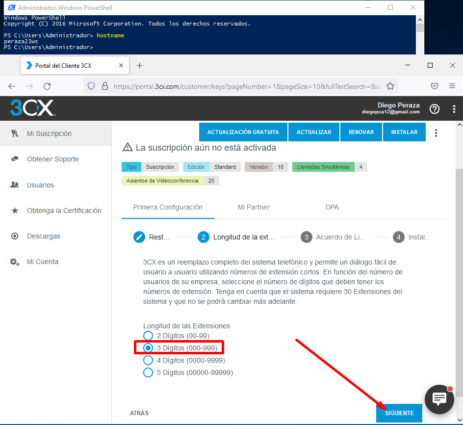
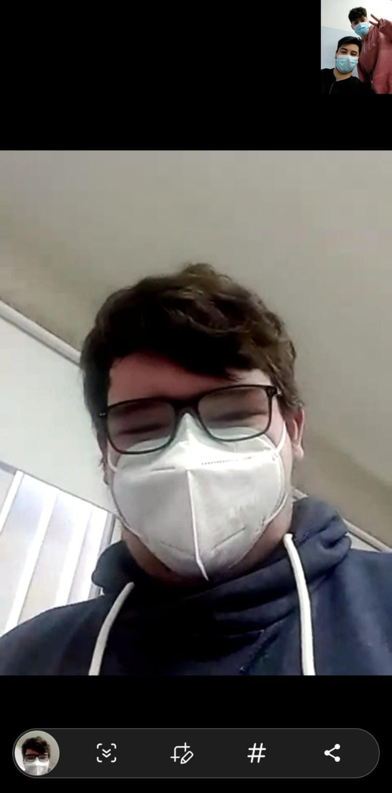

# **Instalación y configuración del Servicio VoIP en Windows 2016 Server**

***Nombre:*** Diego Peraza Cabo
 
***Curso:*** 2º ASIR

  

## **Índice** 

+ [1. Registrarse, instalar y configurar 3CX en el Servidor.](#1)
+ [2. Creación de usuarios](#2)
+ [3. Comprobación desde el móvil](#3)

### **1. Registrarse, instalar y configurar 3CX en el Servidor.** 

- Entramos en la página oficial de 3CX [https://www.3cx.es](https://www.3cx.es) y nos registramos para la obtención de la prueba gratuita por un año.

  

- Pondremos todos nuestros datos que se indican, incluido el número del teléfono móvil. Además en `Tipo de Cuenta` elegimos `Personal`

  

- Le damos a siguiente y nos saltará la primera configuración que realizaremos. Indicamos que nuestro Servidor este Hospedado por 3CX.

  

- Le damos a siguiente.

  

- Le damos a que `No`, ya que no tenemos una copia de seguridad 3CX.

  

- Nuestro dominio sugerido lo dejamos como está y le damos a siguiente.

  

- En en el paso de indicar la `Longitud de las Extensiones`, seleccionaremos la de 3 dígitos.

  

- Aceptamos el Acuerdo de Licencia y pasaremos con la instalación.

  

- Una vez se haya instalado y configurado todo, nuestro portal se verá de la siguiente manera.

  

### **2. Creación de usuarios dentro de la administración** 

- Para acceder a la administración, tendremos que ir al link que nos envían por correo a la hora de registrarnos. Entramos y nos logeamos con la cuenta de usuario `admin`.

  

- Una vez nos hemos logeado, iremos al apartado de `Usuarios`.

  

- Agregamos dos usuarios, uno con el nombre y el número de teléfono móvil personal y otro usuario con los datos de un compañero de clase.

  

### **3. Comprobación del funcionamiento de 3CX mediante Teléfono Móvil** 

- Para comprobar el funcionamiento, tendremos que instalar en nuestro teléfono la aplicación de 3CX.

  

- Entramos en la aplicación y nos logeamos con nuestra cuenta. Además entramos a la pestaña `Estado` y vemos que nos salen los usuarios que hemos creado.

  

- A continuación comprobamos el funcionamiento de algunas funcionalidades de 3CX. Estas comprobaciones han sido realizadas con Salvador González Cueto.

  - Videollamada

    

  - Chat

    

  - Llamada normal

    

    
